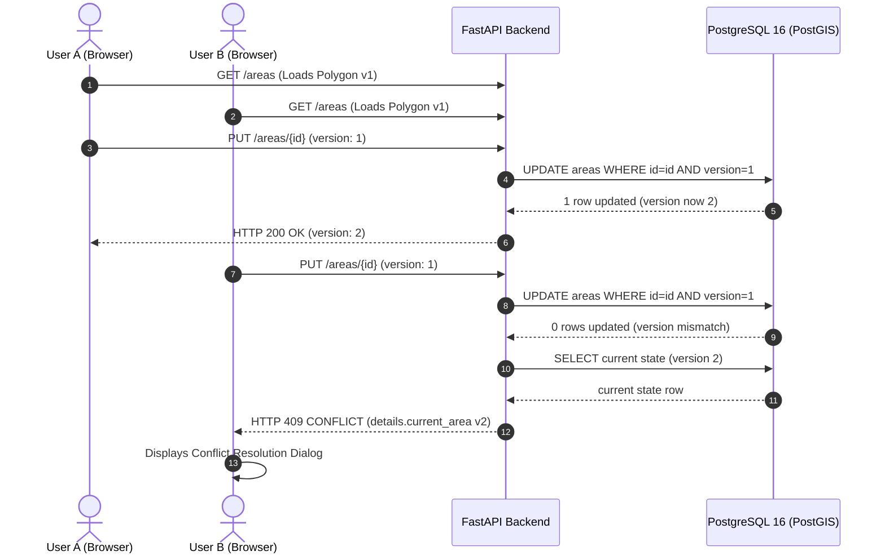

# ADR 003: Optimistic Concurrency Control (OCC) with Monotonic Version Numbers for Collaborative Polygon Edits

## Status
Accepted

## Context
Snapland allows multiple users to view, create, edit, and delete geographic polygon boundaries on a shared real-time map. In collaborative mapping environments, concurrent edits to the same polygon can easily occur:
- User A loads Polygon #42 (Version 1) and begins adjusting vertex coordinates.
- User B simultaneously loads Polygon #42 (Version 1) and reshapes a different boundary edge.
- If both users submit their changes, an uncoordinated system suffers from the classic **Lost Update Anomaly**: whichever user clicks "Save" last silently clobbers the other's modifications.

In GIS workflows, redrawing polygon boundaries is labor-intensive and precision-critical; silently destroying an analyst's work is unacceptable. The system must arbitrate concurrent modifications deterministically without introducing fragile locking mechanisms.

## Alternatives Considered

### 1. Pessimistic Locking (Exclusive Edit Leases)
- *Mechanism*: When a user clicks "Edit", the client acquires an exclusive lease on the polygon row in PostgreSQL or Redis. Other users are blocked from editing until the lock is released or times out.
- *Cons*:
  - **Abandoned Locks**: Network drops, closed browser tabs, or user distraction leave polygons locked until TTL expiry, causing severe user frustration.
  - **Complex Lock Orchestration**: Requires distributed lease renewal, heartbeat loops, and lock-stealing protocols.
  - **Anti-Collaborative**: Completely prevents parallel workflows.

### 2. Last-Write-Wins (LWW)
- *Mechanism*: The database unconditionally applies whichever update arrives last based on server reception time.
- *Cons*: Silently overwrites previous edits without notifying users, guaranteeing data loss in collaborative multi-user sessions.

### 3. Conflict-Free Replicated Data Types (CRDTs) or Operational Transformation (OT)
- *Mechanism*: Represent polygon vertex lists as sequence CRDTs (e.g. Yjs or Automerge) with automatic peer-to-peer merge resolution.
- *Cons*:
  - High algorithmic complexity for v1.
  - **Topological Invalidation Risk**: While CRDTs guarantee mathematical convergence of vertex arrays, merging arbitrary coordinate drags from two users can easily produce non-simple, self-intersecting ("bowtie") polygons that violate OGC GIS validity standards (`ST_IsValid`).

## Decision

We adopt **Optimistic Concurrency Control (OCC)** using monotonic integer version numbers enforced at the database transaction boundary.

### 1. Schema & Versioning
Every row in the `areas` table carries a non-nullable integer `version` initialized to `1` upon creation:
```sql
CREATE TABLE areas (
    id UUID PRIMARY KEY DEFAULT gen_random_uuid(),
    name VARCHAR(255) NOT NULL,
    geom geometry(Polygon, 4326) NOT NULL,
    area_km2 DOUBLE PRECISION NOT NULL,
    version INTEGER NOT NULL DEFAULT 1,
    created_by UUID NOT NULL REFERENCES users(id),
    last_edited_by UUID NOT NULL REFERENCES users(id),
    created_at TIMESTAMPTZ NOT NULL DEFAULT NOW(),
    updated_at TIMESTAMPTZ NOT NULL DEFAULT NOW(),
    deleted_at TIMESTAMPTZ
);
```

### 2. Atomic Database Update Predicate
When a client updates a polygon via `PUT /api/v1/areas/{id}`, it must supply the version number it based its modifications on (`expected_version`):
```sql
UPDATE areas
SET geom = :new_geom,
    name = :new_name,
    area_km2 = :new_area_km2,
    version = version + 1,
    last_edited_by = :user_id,
    updated_at = NOW()
WHERE id = :area_id
  AND version = :expected_version
  AND deleted_at IS NULL
RETURNING version;
```

### 3. Conflict Detection & Error Envelope
- If another user committed an edit first, `version` in the database has already incremented, causing the conditional `UPDATE` query to return `rowcount == 0`.
- The backend detects the condition, queries the current state of the polygon from the database, and responds with HTTP `409 CONFLICT`:
  ```json
  {
    "error": {
      "code": "CONFLICT",
      "message": "Area has been modified by another user",
      "details": {
        "current_area": {
          "id": "123e4567-e89b-12d3-a456-426614174000",
          "name": "Central Park Zone",
          "version": 2,
          "geojson": { ... },
          "area_km2": 1.42,
          "last_edited_by": "876e4567-e89b-12d3-a456-426614174999",
          "updated_at": "2026-10-04T02:00:00Z"
        }
      }
    }
  }
  ```

### 4. Client-Side Conflict Resolution Workflow
When the frontend receives a `409 CONFLICT`, it intercepts the response and opens a dedicated **Conflict Resolution Modal** offering the user three explicit choices:
1. **Accept Remote**: Discard local changes, update the local polygon to the remote geometry and version, and return to view mode.
2. **Force Overwrite**: Fetch the latest remote version number, re-submit the local draft with `version = remote.version`, overriding the conflicting edit.
3. **Save as New**: Preserve local modifications by persisting the edited polygon as a brand-new, independent area entity with a fresh UUID, keeping both polygons on the map.



## Consequences

### Positive:
- **Zero Lock Management**: Stateless backend replicas require no distributed lock manager, eliminating lock timeouts, orphaned locks, and deadlocks.
- **Data Protection**: Eliminates the lost update anomaly completely.
- **Empowered Users**: Users retain complete control over resolving conflicting work rather than having their edits silently dropped.
- **Clean Audit Trail**: Each version increment corresponds to an immutable record inserted into `area_versions` and `audit_logs`.

### Negative / Trade-offs:
- Users only discover conflicts upon saving, rather than during initial vertex manipulation.
- Future roadmap item: Add advisory real-time "User X is currently editing this polygon" awareness markers over the WebSocket bus to warn peers before they begin simultaneous modifications.
