# Snapland – Collaborative GIS Application: High-Level Design (HLD)

> **Assignment**: R&D Team Lead Home Assignment
> **Prepared by**: Candidate
> **Date**: September 2026 · **Revision**: v2

---

## Table of Contents

1. [System Overview](#1-system-overview)
2. [Architecture Diagram](#2-architecture-diagram)
3. [Engineering Principles](#3-engineering-principles)
4. [Repository & Directory Structure](#4-repository--directory-structure)
5. [Technology Stack & Decisions](#5-technology-stack--decisions)
6. [Interface Contracts](#6-interface-contracts)
7. [Component Breakdown](#7-component-breakdown)
8. [Database Design](#8-database-design)
9. [Real-time Layer (WebSocket)](#9-real-time-layer-websocket)
10. [API Design](#10-api-design)
11. [Frontend Architecture](#11-frontend-architecture)
12. [Security Design](#12-security-design)
13. [Caching Strategy](#13-caching-strategy)
14. [Conflict Resolution](#14-conflict-resolution)
15. [Scalability & Horizontal Scaling](#15-scalability--horizontal-scaling)
16. [Observability & Monitoring](#16-observability--monitoring)
17. [Testing Strategy](#17-testing-strategy)
18. [Phased Implementation Plan](#18-phased-implementation-plan)
19. [Deployment & DevOps](#19-deployment--devops)
20. [Known Limitations & Future Work](#20-known-limitations--future-work)

---

## 1. System Overview

**Snapland** is a collaborative, real-time GIS web application where multiple users can simultaneously draw, edit, and analyze geographic polygons on an interactive map. The system supports:

- Multi-user real-time collaboration: live cursors, incremental (delta) drawing previews, presence
- Dual map layers: OpenStreetMap (default) + Satellite imagery via Esri World Imagery (ADR-004: govmap evaluated per assignment requirements; confirmed to serve street basemap tiles rather than aerial photography; Esri is implemented as primary satellite layer with GovMap/OSM as documented fallback/known limitation)
- Persistent polygon storage with full versioning and edit history
- Authoritative area calculation in km² on the WGS84 ellipsoid (PostGIS `geography`), plus a live in-browser estimate while drawing
- Spatial queries bounded to the user's current viewport (GiST-indexed, zoom-aware simplification)
- Authentication, rate limiting, audit logging, and graceful degradation

### 1.1 Scope: Built vs. Documented-Only

The assignment stresses core real-time behavior, architecture, layer switching and database design. Every component is labelled so the deliverable stays honest about what actually exists:

| Status | Components |
|---|---|
| **Built in v1** (docker-compose) | Nginx, 2 × FastAPI instances, PostgreSQL 16 + PostGIS 3.4, Redis 7 (Pub/Sub, Streams, presence, cache, rate limiter), Prometheus, Grafana, GitHub Actions CI |
| **Documented only** (design + ADR, not built) | Read replica, PgBouncer, Loki, Redis Sentinel/Cluster, Kafka/NATS, CD pipeline, transactional outbox |

---

## 2. Architecture Diagram

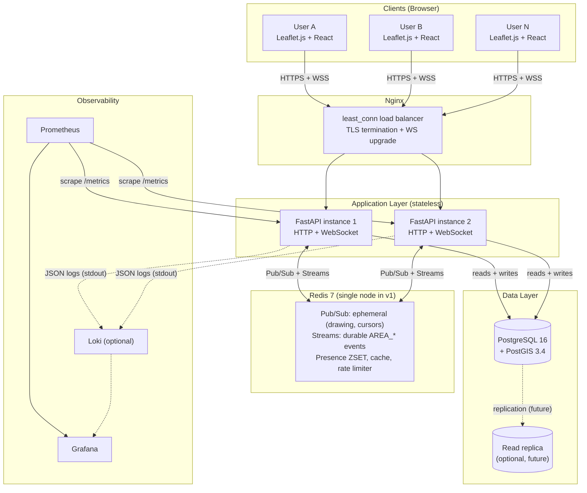

---

## 3. Engineering Principles

> [!IMPORTANT]
> These principles are **non-negotiable** and enforced across all phases and agents.

### 3.1 SOLID

| Principle | Application in Snapland |
|---|---|
| **S** — Single Responsibility | Each service/component has one reason to change. `AreaService` handles business logic only; `AreaRepository` handles DB access only; `SpatialService` handles geometry only. |
| **O** — Open/Closed | New polygon operation types (e.g., multipolygon) extend the `ISpatialService` interface without modifying existing implementations. |
| **L** — Liskov Substitution | `MockWebSocketService` and `RealWebSocketService` are interchangeable behind `IWebSocketService`. Any consumer works with either. |
| **I** — Interface Segregation | `IAreaRepository` is split from `IAreaReadRepository` — read-only consumers get a read-only interface. No fat interfaces. |
| **D** — Dependency Inversion | Services depend on abstractions (interfaces), not on concrete implementations. FastAPI's dependency injection wires concrete classes at runtime. |

### 3.2 No Code Duplication (DRY)

- **The backend is the single source of truth for types.** Pydantic models (`core/domain/`) define every REST and WS payload. TypeScript types are **generated**, not hand-mirrored:
  - REST: FastAPI OpenAPI → `openapi-typescript` → `packages/shared-types/src/generated/api.ts`
  - WS: Pydantic `model_json_schema()` for every WS message → `json-schema-to-typescript` → `packages/shared-types/src/generated/ws.ts`
  - `scripts/gen_types.py` runs both; CI fails when `git diff --exit-code packages/shared-types` is non-empty (drift check).
  - **Bootstrap:** Phases 0–1 start before the backend exists, so the hand-written types in §6.3 seed `packages/shared-types/src/`. Phase 2 replaces them with generated output, which must remain a compatible superset.
- Validation limits (coordinate ranges, max vertices, max area, name length) are defined once in §12.3 and implemented once per language: `config.py` (authoritative) and `geoUtils.ts` (UX pre-check only; the server always re-validates).
- Backend: abstract `BaseRepository` with common CRUD patterns; concrete repos only add domain-specific methods.
- Frontend: shared hooks (`useWebSocket`, `useMapBounds`) — no inline re-implementations.
- Agent prompts (§18) reference HLD sections instead of restating them, so a change here cannot leave a prompt stale.

### 3.3 Separation of Concerns

- **Strict layer boundary**: Routes → Services → Repositories → DB. No DB access in routes. No business logic in repositories.
- **Frontend**: Hooks for state logic, Components for rendering only — no business logic in JSX.
- **No cross-domain imports**: Frontend cannot import backend modules and vice versa. Shared types package is the only bridge.

### 3.4 Interface-First Design

Every service and repository is defined as an interface (Python `Protocol` / TypeScript `interface`) **before** implementation. Tests mock the interface; implementations satisfy it. This enables parallel development by agents.

---

## 4. Repository & Directory Structure

```
snapland/
│
├── backend/                             # Python FastAPI application
│   ├── src/snapland/
│   │   ├── api/                         # HTTP & WS route handlers (thin layer)
│   │   │   ├── v1/
│   │   │   │   ├── auth.py              # register, login, refresh, logout, ws-ticket
│   │   │   │   ├── areas.py
│   │   │   │   ├── users.py
│   │   │   │   └── health.py            # /health/live, /health/ready, /health/db
│   │   │   └── websocket/
│   │   │       ├── route.py             # /ws endpoint: ticket + Origin check, lifecycle
│   │   │       ├── manager.py           # connection registry, per-connection outbound queues
│   │   │       └── handlers.py          # message dispatch, rate-limit buckets
│   │   │
│   │   ├── core/                        # Business logic — depends only on interfaces
│   │   │   ├── interfaces/              # Python Protocols
│   │   │   │   ├── repositories.py
│   │   │   │   ├── services.py
│   │   │   │   ├── cache.py
│   │   │   │   └── realtime.py          # IEphemeralBus, IEventStream, IPresenceStore
│   │   │   ├── services/
│   │   │   │   ├── area_service.py
│   │   │   │   ├── auth_service.py
│   │   │   │   ├── spatial_service.py
│   │   │   │   ├── conflict_service.py
│   │   │   │   └── audit_service.py
│   │   │   └── domain/                  # Pure Python, no DB dependency
│   │   │       ├── area.py
│   │   │       ├── user.py
│   │   │       ├── events.py            # domain events (AreaCreated, ...)
│   │   │       └── ws_messages.py       # Pydantic WS envelope + payload models
│   │   │
│   │   ├── infrastructure/              # Concrete implementations of interfaces
│   │   │   ├── db/
│   │   │   │   ├── models.py            # SQLAlchemy ORM models
│   │   │   │   ├── session.py           # async engine + pool
│   │   │   │   └── repositories/
│   │   │   │       ├── base.py
│   │   │   │       ├── area_repository.py
│   │   │   │       ├── user_repository.py
│   │   │   │       └── session_repository.py
│   │   │   ├── cache/
│   │   │   │   ├── redis_client.py
│   │   │   │   └── cache_repository.py
│   │   │   ├── pubsub/
│   │   │   │   ├── redis_pubsub.py      # IEphemeralBus
│   │   │   │   ├── redis_streams.py     # IEventStream (durable AREA_* events)
│   │   │   │   └── redis_presence.py    # IPresenceStore
│   │   │   └── jobs/
│   │   │       └── retention.py         # APScheduler cleanup job
│   │   │
│   │   ├── middleware/
│   │   │   ├── rate_limiter.py
│   │   │   ├── request_id.py
│   │   │   ├── error_handler.py
│   │   │   ├── metrics.py
│   │   │   └── timeout.py
│   │   │
│   │   └── config.py                    # Settings via pydantic-settings
│   │
│   ├── migrations/                      # Alembic
│   │   ├── versions/
│   │   └── env.py
│   │
│   ├── tests/
│   │   ├── unit/
│   │   │   ├── core/
│   │   │   │   ├── test_area_service.py
│   │   │   │   ├── test_spatial_service.py
│   │   │   │   ├── test_auth_service.py
│   │   │   │   └── test_conflict_service.py
│   │   │   ├── api/
│   │   │   │   ├── test_outbound_queue.py   # coalescing, overflow, batching
│   │   │   │   └── test_ws_handlers.py      # buckets, delta validation
│   │   │   └── infrastructure/
│   │   │       └── test_rate_limiter.py
│   │   ├── integration/
│   │   │   ├── test_areas_api.py
│   │   │   ├── test_auth_api.py
│   │   │   ├── test_websocket.py
│   │   │   ├── test_presence.py
│   │   │   └── test_spatial_queries.py
│   │   └── conftest.py                  # Fixtures: test DB, fakeredis/real Redis, test client
│   │
│   ├── pyproject.toml
│   ├── Dockerfile
│   └── README.md
│
├── frontend/                            # React + TypeScript application
│   ├── src/
│   │   ├── api/                         # HTTP client layer (typed, interface-backed)
│   │   │   ├── interfaces/
│   │   │   │   ├── IAreaApi.ts
│   │   │   │   ├── IAuthApi.ts
│   │   │   │   └── IWebSocketService.ts
│   │   │   ├── http/
│   │   │   │   ├── areaApi.ts
│   │   │   │   └── authApi.ts
│   │   │   └── mock/                    # Mock implementations for Phase 1
│   │   │       ├── mockAreaApi.ts
│   │   │       └── mockWebSocketService.ts
│   │   │
│   │   ├── providers/
│   │   │   └── ApiProvider.tsx          # injects mock or real services (VITE_USE_MOCK_API)
│   │   │
│   │   ├── pages/
│   │   │   ├── LoginPage.tsx
│   │   │   └── MapPage.tsx
│   │   │
│   │   ├── components/
│   │   │   ├── map/
│   │   │   │   ├── MapView.tsx
│   │   │   │   ├── DrawingLayer.tsx
│   │   │   │   ├── VertexEditor.tsx     # draggable vertex markers (L.Marker + divIcon)
│   │   │   │   ├── CollaborationLayer.tsx
│   │   │   │   ├── AreaOverlay.tsx
│   │   │   │   └── BaseLayerControl.tsx
│   │   │   ├── ui/
│   │   │   │   ├── AreaPanel.tsx
│   │   │   │   ├── AreaList.tsx
│   │   │   │   ├── AreaDetails.tsx      # name, ≈km², version history
│   │   │   │   ├── UserPresenceBar.tsx
│   │   │   │   └── ConflictDialog.tsx
│   │   │   └── auth/
│   │   │       ├── LoginForm.tsx
│   │   │       └── RegisterForm.tsx
│   │   │
│   │   ├── hooks/
│   │   │   ├── useWebSocket.ts          # WS lifecycle, backoff, polling fallback
│   │   │   ├── useMapBounds.ts          # viewport bbox + zoom
│   │   │   ├── useDrawing.ts            # drawing state machine, delta batching
│   │   │   ├── useAreas.ts              # area CRUD + optimistic updates
│   │   │   └── useAuth.ts               # access token in memory, silent refresh
│   │   │
│   │   ├── services/
│   │   │   ├── websocket/
│   │   │   │   └── WebSocketService.ts
│   │   │   └── map/
│   │   │       ├── LayerManager.ts      # base-layer swap, cross-fade, fallback
│   │   │       └── ProjectionUtils.ts   # [lat,lng] ↔ [lng,lat], optional proj4 helpers
│   │   │
│   │   ├── store/                       # Zustand stores
│   │   │   ├── areasStore.ts
│   │   │   ├── collaborationStore.ts
│   │   │   └── authStore.ts
│   │   │
│   │   ├── types/                       # Frontend-only types (imports from shared-types)
│   │   └── utils/
│   │       ├── geoUtils.ts              # coordinate flips, bbox helpers, pre-validation
│   │       └── areaCalculation.ts       # @turf/area wrapper (spherical estimate)
│   │
│   ├── tests/
│   │   ├── unit/
│   │   │   ├── hooks/
│   │   │   │   ├── useDrawing.test.ts
│   │   │   │   └── useWebSocket.test.ts
│   │   │   ├── services/
│   │   │   │   └── LayerManager.test.ts
│   │   │   └── utils/
│   │   │       ├── geoUtils.test.ts
│   │   │       └── areaCalculation.test.ts
│   │   └── e2e/                         # Playwright
│   │       ├── drawing.spec.ts
│   │       ├── layer-switch.spec.ts
│   │       ├── collaboration.spec.ts
│   │       └── auth.spec.ts
│   │
│   ├── vite.config.ts
│   ├── tsconfig.json
│   ├── Dockerfile
│   └── README.md
│
├── packages/
│   └── shared-types/                    # TS types: bootstrap (hand-written) → generated from backend
│       ├── src/
│       │   ├── area.ts                  # bootstrap types (HLD §6.3)
│       │   ├── websocket.ts
│       │   ├── auth.ts
│       │   ├── geo.ts
│       │   └── generated/               # api.ts + ws.ts, produced by scripts/gen_types.py
│       └── package.json
│
├── docs/
│   ├── hld.md                           # This document
│   ├── adr/                             # Architecture Decision Records
│   │   ├── 001-postgis-choice.md
│   │   ├── 002-redis-pubsub-and-streams.md
│   │   ├── 003-occ-conflict.md
│   │   └── 004-projections-and-satellite-source.md
│   ├── performance.md                   # benchmark + load-test results (Phase 4A)
│   └── api/                             # OpenAPI spec (auto-generated)
│
├── infra/
│   ├── docker-compose.yml               # postgres, redis, migrate (one-shot), backend ×2, frontend, nginx, prometheus, grafana
│   ├── docker-compose.test.yml          # Test-only compose (no volumes)
│   ├── nginx/
│   │   └── nginx.conf
│   └── monitoring/
│       ├── prometheus.yml
│       └── grafana/
│
├── loadtest/
│   └── ws_collab.js                     # k6 WebSocket scenario (Phase 4A)
│
├── scripts/
│   ├── setup.sh                         # One-command local setup
│   ├── seed_db.py                       # Test data seeding (--polygons 10000)
│   └── gen_types.py                     # OpenAPI/JSON Schema → TypeScript
│
├── .env.example
├── .github/
│   └── workflows/
│       └── ci.yml                       # Lint + Test + Build on PR
│
└── README.md                            # Project root: setup + architecture overview
```

---

## 5. Technology Stack & Decisions

| Layer | Choice | Rationale |
|---|---|---|
| **Backend Language** | Python 3.12 + **FastAPI** | Async-first, native WebSocket, OpenAPI auto-gen, Pydantic typed |
| **WebSocket** | FastAPI native (Starlette WS) + in-house protocol | No third-party collaborative plugins; presence, fan-out, backpressure and catch-up are implemented in-house |
| **Database** | **PostgreSQL 16 + PostGIS 3.4** | Required; GiST spatial indexing, geodesic area via `ST_Area(::geography)` |
| **ORM / Migrations** | SQLAlchemy 2 (async) + Alembic | Type-safe, async pool, declarative migrations |
| **Geometry ORM** | **geoalchemy2** (`spatial_index=False`) | Column type + spatial functions; the GiST index is created explicitly in the migration so its name and predicate are controlled |
| **Real-time bus** | **Redis 7** | Pub/Sub for ephemeral traffic (drawing previews, cursors, presence changes); **Streams** for durable `AREA_*` events and reconnect catch-up; sorted set for presence; also cache + rate-limiter store |
| **Redis client** | `redis-py` (`redis.asyncio`) | `aioredis` was merged into redis-py and is no longer maintained |
| **Auth libraries** | `PyJWT[crypto]` + `bcrypt` | `python-jose` and `passlib` are effectively unmaintained (passlib breaks with bcrypt ≥ 4.1) |
| **Auth model** | JWT RS256: access 15 min (kept in memory) + refresh 7 d (rotated, `httpOnly` cookie) | Stateless access checks; refresh reuse detection; no tokens in `localStorage` |
| **WS authentication** | One-time **ticket** (30 s, single use) from `POST /auth/ws-ticket` | Keeps JWTs out of URLs / access logs |
| **Frontend Framework** | **React 18 + TypeScript** (Vite) | Component model + strict typing |
| **State Management** | **Zustand** | Lightweight, testable without Provider wrapping |
| **Map Library** | **Leaflet.js 1.9** | Required; `L.tileLayer` handles OSM and XYZ tiles natively |
| **Satellite Layer** | **Esri World Imagery** (primary satellite layer; govmap evaluated in Phase 1/ADR-004 was found to be vector/street only) | Configurable via `VITE_SATELLITE_TILE_URL` (defaults to Esri World Imagery); GovMap/OSM fallback |
| **Spatial Calc (FE)** | **`@turf/area`**, `@turf/kinks` | Live estimate (spherical) and self-intersection pre-check while drawing |
| **Spatial Calc (BE)** | **PostGIS `ST_Area(::geography)`** authoritative; `shapely` + `pyproj.Geod` in unit tests | Same WGS84 ellipsoid on both sides of the test boundary |
| **Projections** | `proj4` (frontend, only if an ITM/EPSG:2039 source is confirmed) | See §11.6 |
| **Testing (BE)** | **pytest + pytest-asyncio + httpx + fakeredis** | Async unit + integration tests |
| **Testing (FE)** | **Vitest + Testing Library + Playwright** | Unit hooks/utils + E2E |
| **Observability** | `prometheus-client`, `structlog` | Metrics + JSON logs with request/user correlation |
| **Load testing** | **k6** (WebSocket scenario) | Scriptable, supports WS |
| **Containerization** | **Docker + docker-compose** | Local dev + CI parity |
| **API Docs** | **Swagger / OpenAPI** (auto-generated) | FastAPI generates from Pydantic schemas |

---

## 6. Interface Contracts

> [!IMPORTANT]
> Interfaces are defined **before** implementation begins. All agents work against these contracts. Changes to an interface require explicit team discussion.

### 6.1 Backend Python Protocols

```python
# backend/src/snapland/core/interfaces/repositories.py

from dataclasses import dataclass
from typing import Protocol, Sequence
from uuid import UUID
from snapland.core.domain.area import Area, AreaVersion
from snapland.core.domain.user import User, Session

@dataclass(frozen=True)
class AreaPage:
    areas: Sequence[Area]
    truncated: bool            # True when more than `limit` areas matched the viewport

class IAreaReadRepository(Protocol):
    async def get_by_id(self, area_id: UUID) -> Area | None: ...
    async def get_within_bounds(
        self, min_lng: float, min_lat: float, max_lng: float, max_lat: float,
        *, zoom: int | None = None, limit: int = 500,
    ) -> AreaPage: ...
    async def get_version_history(self, area_id: UUID) -> Sequence[AreaVersion]: ...

class IAreaRepository(IAreaReadRepository, Protocol):
    # create / update / soft_delete write the area_versions row (and the audit row,
    # when an audit entry is supplied) in the SAME transaction as the area row.
    async def create(self, area: Area) -> Area: ...
    async def update(self, area: Area, expected_version: int) -> Area | None: ...   # None = version mismatch
    async def soft_delete(self, area_id: UUID, deleted_by: UUID) -> bool: ...

class IUserRepository(Protocol):
    async def get_by_email(self, email: str) -> User | None: ...
    async def get_by_id(self, user_id: UUID) -> User | None: ...
    async def create(self, user: User) -> User: ...

class ISessionRepository(Protocol):
    """Refresh-token sessions. Rotation keeps the old row (revoked_at set) so reuse can be detected."""
    async def create(self, session: Session) -> Session: ...
    async def get_by_token_hash(self, token_hash: str) -> Session | None: ...
    async def revoke(self, session_id: UUID) -> None: ...
    async def revoke_family(self, family_id: UUID) -> int: ...
    async def revoke_all_for_user(self, user_id: UUID) -> int: ...

# backend/src/snapland/core/interfaces/cache.py
class ICacheRepository(Protocol):
    async def get(self, key: str) -> str | None: ...
    async def set(self, key: str, value: str, ttl_seconds: int) -> None: ...
    async def incr(self, key: str) -> int: ...          # used for the viewport-cache epoch
    async def getdel(self, key: str) -> str | None: ... # atomic ticket redemption
```

```python
# backend/src/snapland/core/interfaces/services.py

from dataclasses import dataclass
from typing import Protocol, Sequence
from uuid import UUID
from snapland.core.domain.area import Area, AreaVersion, Coordinate, CreateAreaRequest, UpdateAreaRequest
from snapland.core.domain.user import User, TokenResponse
from snapland.core.domain.events import DomainEvent
from snapland.core.interfaces.repositories import AreaPage

class IAreaService(Protocol):
    async def create_area(self, req: CreateAreaRequest, user_id: UUID) -> Area: ...
    async def update_area(self, area_id: UUID, req: UpdateAreaRequest, user_id: UUID) -> Area: ...   # raises ConflictError(current_area)
    async def delete_area(self, area_id: UUID, user_id: UUID) -> None: ...
    async def get_areas_in_bounds(self, min_lng: float, min_lat: float, max_lng: float, max_lat: float,
                                  *, zoom: int | None = None, limit: int = 500) -> AreaPage: ...
    async def get_history(self, area_id: UUID) -> Sequence[AreaVersion]: ...

@dataclass(frozen=True)
class PolygonValidation:
    valid: bool
    reason: str | None = None   # machine-readable, e.g. "SELF_INTERSECTION", "TOO_MANY_VERTICES"

class ISpatialService(Protocol):
    def calculate_area_km2(self, coordinates: Sequence[Coordinate]) -> float: ...          # WGS84 ellipsoid (pyproj.Geod)
    def validate_polygon(self, coordinates: Sequence[Coordinate]) -> PolygonValidation: ...
    def to_geojson_polygon(self, coordinates: Sequence[Coordinate]) -> dict: ...           # closes ring, [lng, lat] order
    def simplify_tolerance_deg(self, zoom: int | None) -> float: ...                       # 0 = no simplification

class IAuthService(Protocol):
    async def register(self, email: str, password: str, display_name: str) -> User: ...
    async def login(self, email: str, password: str) -> TokenResponse: ...                 # includes refresh token for the cookie
    async def refresh_token(self, refresh_token: str) -> TokenResponse: ...                # rotates; reuse ⇒ revoke family
    async def revoke_token(self, refresh_token: str) -> None: ...
    async def issue_ws_ticket(self, user_id: UUID) -> str: ...                             # random, TTL 30 s, single use
    async def redeem_ws_ticket(self, ticket: str) -> UUID | None: ...                      # atomic GETDEL

@dataclass(frozen=True)
class RateLimitResult:
    allowed: bool
    retry_after_ms: int = 0

class IRateLimiter(Protocol):
    async def check_limit(self, user_id: str, bucket: str, limit: int, window_seconds: int) -> RateLimitResult: ...

class IEventPublisher(Protocol):
    """Domain events → durable stream. Called AFTER the DB transaction commits."""
    async def publish(self, event: DomainEvent) -> None: ...
```

```python
# backend/src/snapland/core/interfaces/realtime.py

from dataclasses import dataclass
from typing import AsyncIterator, Protocol, Sequence
from uuid import UUID
from snapland.core.domain.ws_messages import ServerMessage, PresenceUser

@dataclass(frozen=True)
class Envelope:
    origin: str                # INSTANCE_ID of the publishing instance (receivers skip their own)
    message: ServerMessage

@dataclass(frozen=True)
class CatchUp:
    events: Sequence[tuple[str, ServerMessage]]   # (stream id, AREA_* message)
    resync_required: bool                     # last_id older than retention ⇒ client must refetch over HTTP

class IEphemeralBus(Protocol):                # Redis Pub/Sub — loss-tolerant
    async def publish(self, envelope: Envelope) -> None: ...
    def subscribe(self) -> AsyncIterator[Envelope]: ...

class IEventStream(Protocol):                 # Redis Streams — durable, replayable
    async def append(self, message: ServerMessage) -> str: ...                       # returns stream id (eventId)
    async def read_since(self, last_id: str, limit: int = 500) -> CatchUp: ...
    def follow(self) -> AsyncIterator[tuple[str, ServerMessage]]: ...                # XREAD BLOCK from "$"

class IPresenceStore(Protocol):               # Redis ZSET, heartbeat-based
    async def heartbeat(self, user_id: UUID, conn_id: str, display_name: str) -> None: ...
    async def heartbeat_batch(self, items: Sequence[tuple[UUID, str, str]]) -> None: ...
    async def add_connection(self, user_id: UUID, conn_id: str, display_name: str) -> bool: ... # True ⇒ first active connection
    async def remove(self, user_id: UUID, conn_id: str) -> bool: ...             # True ⇒ user has no connections left
    async def snapshot(self) -> Sequence[PresenceUser]: ...
    async def reap_expired(self) -> Sequence[UUID]: ...                          # crash recovery: users to announce as left
```

### 6.2 Frontend TypeScript Interfaces

```typescript
// frontend/src/api/interfaces/IAreaApi.ts
import type { Area, AreasPage, AreaVersion, CreateAreaRequest, UpdateAreaRequest, BoundingBox } from '@snapland/shared-types';

export interface IAreaApi {
  getAreasInBounds(bounds: BoundingBox, zoom: number): Promise<AreasPage>;
  getAreaById(id: string): Promise<Area>;
  createArea(req: CreateAreaRequest): Promise<Area>;
  updateArea(id: string, req: UpdateAreaRequest): Promise<Area>;   // rejects with ConflictError (carries currentArea) on 409
  deleteArea(id: string): Promise<void>;
  getAreaHistory(id: string): Promise<AreaVersion[]>;
}

// frontend/src/api/interfaces/IWebSocketService.ts
import type { WsMessage, ClientMessageType, ServerMessageType } from '@snapland/shared-types';

export type ConnectionState = 'connecting' | 'connected' | 'reconnecting' | 'polling' | 'disconnected';
export type MessageHandler<T extends ServerMessageType> = (payload: WsMessage<T>['payload'], eventId?: string) => void;

export interface IWebSocketService {
  /** ticketProvider is invoked before EVERY (re)connect — tickets are single-use with a 30 s TTL. */
  connect(ticketProvider: () => Promise<string>): void;
  disconnect(): void;
  send<T extends ClientMessageType>(message: WsMessage<T>): void;
  /** Server frames are JSON arrays (micro-batches); the service unpacks them and dispatches per message. */
  on<T extends ServerMessageType>(type: T, handler: MessageHandler<T>): () => void;
  onStateChange(handler: (state: ConnectionState) => void): () => void;
  readonly connectionState: ConnectionState;   // 'polling' = degraded mode after 5 consecutive failures
  readonly lastEventId: string | null;         // sent as ?lastEventId= on reconnect
}

// frontend/src/api/interfaces/IAuthApi.ts
import type { LoginRequest, RegisterRequest, TokenResponse } from '@snapland/shared-types';

export interface IAuthApi {
  login(req: LoginRequest): Promise<TokenResponse>;      // refresh token arrives as httpOnly cookie
  register(req: RegisterRequest): Promise<TokenResponse>;
  refresh(): Promise<TokenResponse>;                     // cookie-based; also used to restore the session on page load
  logout(): Promise<void>;
  getWsTicket(): Promise<string>;                        // POST /auth/ws-ticket
}
```

### 6.3 Shared Types Package (bootstrap — superseded by generated types in Phase 2)

```typescript
// packages/shared-types/src/geo.ts
export interface Coordinate { lat: number; lng: number; }
export interface BoundingBox { minLng: number; minLat: number; maxLng: number; maxLat: number; }

// packages/shared-types/src/area.ts
export interface Area {
  id: string;
  name: string;
  coordinates: Coordinate[];      // open ring; server closes it when building GeoJSON
  areaKm2: number;                // authoritative, from PostGIS
  version: number;
  createdBy: string;
  lastEditedBy: string;
  createdAt: string;
  updatedAt: string;
}
export interface AreasPage { areas: Area[]; truncated: boolean; }
export interface AreaVersion {
  versionNumber: number; editedBy: string; changeType: 'create' | 'update' | 'delete';
  areaKm2: number; createdAt: string; diff: Record<string, unknown>;
}
export interface CreateAreaRequest { name: string; coordinates: Coordinate[]; }
export interface UpdateAreaRequest { name?: string; coordinates?: Coordinate[]; version: number; }

// packages/shared-types/src/websocket.ts
export type ClientMessageType = 'DRAW_START' | 'DRAW_UPDATE' | 'DRAW_COMMIT' | 'DRAW_CANCEL' | 'CURSOR_MOVE';
export type ServerMessageType =
  | 'REMOTE_DRAW' | 'CURSOR_MOVE'
  | 'AREA_SAVED' | 'AREA_UPDATED' | 'AREA_DELETED'
  | 'USER_JOINED' | 'USER_LEFT' | 'PRESENCE_SNAPSHOT'
  | 'RESYNC_REQUIRED' | 'ERROR';
export type WsMessageType = ClientMessageType | ServerMessageType;

export interface PresenceUser { userId: string; displayName: string; }

export interface WsPayloadMap {
  // client → server
  DRAW_START:   { shapeId: string; point: Coordinate };
  DRAW_UPDATE:  { shapeId: string; seq: number; fromIndex: number; append: Coordinate[] };   // delta, not full ring
  DRAW_COMMIT:  { shapeId: string; name: string; points: Coordinate[] };                     // full ring, authoritative
  DRAW_CANCEL:  { shapeId: string };
  // both directions (server adds userId)
  CURSOR_MOVE:  { lat: number; lng: number; userId?: string };
  // server → client
  REMOTE_DRAW:  { userId: string; shapeId: string; phase: 'start' | 'update' | 'commit' | 'cancel';
                  seq?: number; fromIndex?: number; append?: Coordinate[]; name?: string; points?: Coordinate[] };
  AREA_SAVED:   { area: Area; shapeId?: string };          // shapeId lets peers drop the matching preview
  AREA_UPDATED: { area: Area };
  AREA_DELETED: { areaId: string };
  USER_JOINED:  { user: PresenceUser };
  USER_LEFT:    { userId: string };
  PRESENCE_SNAPSHOT: { users: PresenceUser[] };
  RESYNC_REQUIRED: { reason?: string };
  ERROR:        { code: string; message?: string; retryAfterMs?: number };
}

export interface WsMessage<T extends WsMessageType = WsMessageType> {
  type: T;
  payload: WsPayloadMap[T];
  eventId?: string;           // present on durable events (Redis Streams id); clients store the latest
}
```

---

## 7. Component Breakdown

### 7.1 Backend Layer Diagram

```mermaid
flowchart LR
    subgraph API["API Layer (Routes)"]
        Auth["auth.py"]
        Areas["areas.py"]
        WS["websocket/\nroute · handlers · manager"]
        Health["health.py"]
    end

    subgraph Core["Core Layer (Business Logic)"]
        AuthSvc["AuthService\nimpl IAuthService"]
        AreaSvc["AreaService\nimpl IAreaService"]
        SpatialSvc["SpatialService\nimpl ISpatialService"]
        ConflictSvc["ConflictService"]
        AuditSvc["AuditService"]
        RateLimiter["RateLimiter\nimpl IRateLimiter"]
    end

    subgraph Infra["Infrastructure Layer"]
        AreaRepo["AreaRepository"]
        UserRepo["UserRepository"]
        SessionRepo["SessionRepository"]
        CacheRepo["CacheRepository"]
        Bus["RedisEphemeralBus\n(Pub/Sub)"]
        Streams["RedisEventStream\n(Streams)"]
        Presence["RedisPresenceStore\n(ZSET)"]
    end

    subgraph Domain["Domain Models (Pure)"]
        AreaModel["Area"]
        UserModel["User"]
        Events["DomainEvents"]
    end

    API --> Core
    Core --> Infra
    Core --> Domain
    Infra --> Domain
```

### 7.2 Frontend Module Map

| Module | Interface | Responsibility |
|---|---|---|
| `WebSocketService` | `IWebSocketService` | WS lifecycle, ticket fetch per connect, backoff + jitter, `polling` fallback, array-frame unpacking, `lastEventId` |
| `areaApi` | `IAreaApi` | HTTP area CRUD |
| `mockWebSocketService` | `IWebSocketService` | Phase 1 mock — same interface, in-memory, simulates presence/delta drawing/disconnects |
| `mockAreaApi` | `IAreaApi` | Phase 1 mock — same interface, local state, enforces versions (throws `ConflictError`) |
| `LayerManager` | — | Leaflet base-layer swap: add → cross-fade → remove, timeout/`tileerror` fallback to Esri |
| `ProjectionUtils` | — | `[lat,lng]` ↔ `[lng,lat]` conversion, GeoJSON ↔ Leaflet, optional `proj4` transforms |
| `useWebSocket` | consumes `IWebSocketService` | React hook for WS state |
| `useDrawing` | — | Polygon drawing state machine, vertex batching (≤ 15 Hz) |
| `useAreas` | consumes `IAreaApi` | Area CRUD with optimistic updates, polling refetch in degraded mode |
| `useMapBounds` | — | Viewport bbox + zoom tracking on map move |

---

## 8. Database Design

### 8.1 Entity Relationship Diagram

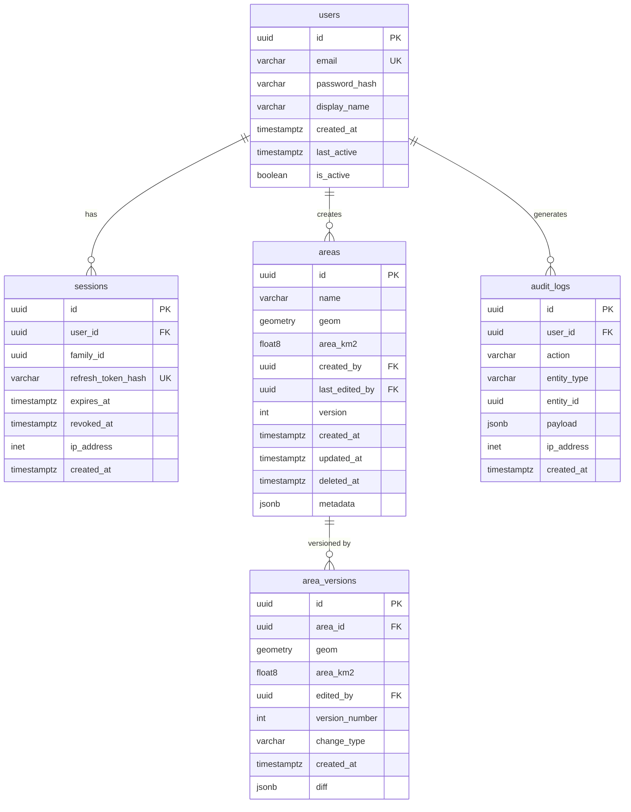

### 8.2 Key Design Decisions

| Decision | Detail |
|---|---|
| **Geometry type** | `geometry(Polygon, 4326)` — WGS84 for interoperability. Holes and MultiPolygon are out of scope for v1 (ADR-001). |
| **Spatial index** | `CREATE INDEX areas_geom_gist ON areas USING GIST (geom) WHERE deleted_at IS NULL;` — partial, so soft-deleted rows never bloat the index. Every viewport query therefore includes `deleted_at IS NULL`. |
| **Other indexes** | `area_versions (area_id, version_number)` UNIQUE · `audit_logs (user_id, created_at DESC)` · `audit_logs (entity_type, entity_id, created_at DESC)` · `areas (deleted_at) WHERE deleted_at IS NOT NULL` (retention job) · `sessions (refresh_token_hash)` UNIQUE, `sessions (user_id)` · `users (lower(email))` UNIQUE |
| **Soft deletes** | `deleted_at IS NULL` filter on all reads; purge job in §Phase 4A |
| **Versioning** | Immutable `area_versions` log (version 1 written on create); `areas.version` is a monotonic counter used for OCC |
| **Version diff** | `area_versions.diff` stores the delta as JSON: `{"name": {"old":"...", "new":"..."}, "geom_changed": true, "area_km2_delta": 0.05}`, computed on write against the previous version |
| **Area calculation** | `ST_Area(geom::geography) / 1e6` — geodesic km² on the WGS84 ellipsoid. Never computed on EPSG:3857 geometry (§11.6). |
| **Atomicity** | Area row + `area_versions` row + `audit_logs` row are written in **one transaction**. The domain event is published to Redis Streams only **after commit**. |
| **Connection pooling** | SQLAlchemy async pool over asyncpg: `pool_size=10, max_overflow=10` per instance. `instances × 20` must stay below Postgres `max_connections` (default 100); PgBouncer is documented for larger fleets. |
| **Large datasets** | Assume 10,000+ polygons per region: viewport queries return at most `limit` (default 500) rows plus a `truncated` flag; below zoom 16 geometries are simplified with `ST_SimplifyPreserveTopology` (tolerance ≈ 1 px). `scripts/seed_db.py --polygons 10000` provides the benchmark dataset. |
| **Retention** | Soft-deleted areas purged after 90 days (their versions after 1 year); `audit_logs` kept 1 year. Monthly partitioning of `audit_logs` is a documented future step. |
| **Migrations** | Alembic, executed by a one-shot `migrate` service in docker-compose — **not** by each app replica (avoids concurrent-upgrade races). |

### 8.3 Critical SQL Patterns

```sql
-- Viewport-bounded fetch (GiST index; ST_Intersects already uses the index, no separate && needed).
-- :limit_plus_one = limit + 1 so the service can set `truncated` without a COUNT(*).
-- :tolerance = 0 disables simplification (zoom >= 16 or unknown).
SELECT id, name, area_km2, version,
       ST_AsGeoJSON(
         CASE WHEN :tolerance > 0
              THEN ST_SimplifyPreserveTopology(geom, :tolerance)
              ELSE geom END
       ) AS geom_json
FROM areas
WHERE deleted_at IS NULL
  AND ST_Intersects(geom, ST_MakeEnvelope(:min_lng, :min_lat, :max_lng, :max_lat, 4326))
ORDER BY updated_at DESC
LIMIT :limit_plus_one;

-- OCC update: geometry parsed once (CTE); 0 rows returned ⇒ version mismatch.
-- The repository inserts the area_versions row in the same transaction using the RETURNING row.
WITH new_geom AS (
  SELECT ST_SetSRID(ST_GeomFromGeoJSON(:geom_json), 4326) AS g
)
UPDATE areas a
SET geom           = n.g,
    area_km2       = ST_Area(n.g::geography) / 1e6,
    name           = COALESCE(:name, a.name),
    version        = a.version + 1,
    last_edited_by = :user_id,
    updated_at     = NOW()
FROM new_geom n
WHERE a.id = :id AND a.version = :expected_version AND a.deleted_at IS NULL
RETURNING a.*;
-- Name-only updates use a variant without the CTE (no geometry recompute).
```

---

## 9. Real-time Layer (WebSocket)

### 9.1 Message Protocol

Client → server frames carry **one** message. Server → client frames are **always a JSON array** (a micro-batch, §9.3).

```jsonc
// Client → Server
{ "type": "DRAW_START",  "payload": { "shapeId": "tmp-abc", "point": {"lat":31.77,"lng":35.21} } }
{ "type": "DRAW_UPDATE", "payload": { "shapeId": "tmp-abc", "seq": 3, "fromIndex": 4, "append": [{"lat":31.78,"lng":35.22}] } }
{ "type": "DRAW_COMMIT", "payload": { "shapeId": "tmp-abc", "name": "Zone A", "points": [ /* full ring, authoritative */ ] } }
{ "type": "DRAW_CANCEL", "payload": { "shapeId": "tmp-abc" } }
{ "type": "CURSOR_MOVE", "payload": { "lat": 31.77, "lng": 35.21 } }

// Server → Client (one frame = array)
[
  { "type": "REMOTE_DRAW", "payload": { "userId": "uuid", "shapeId": "tmp-abc", "phase": "update", "seq": 3, "fromIndex": 4, "append": [ ... ] } },
  { "type": "CURSOR_MOVE", "payload": { "userId": "uuid", "lat": 31.77, "lng": 35.21 } },
  { "type": "AREA_SAVED",  "eventId": "1727512345678-0", "payload": { "area": { "id": "uuid", ... }, "shapeId": "tmp-abc" } }
]
```

**Delta semantics.** `DRAW_UPDATE` carries only the vertices added since the previous update; `fromIndex` is the number of vertices the sender already had. A receiver applies an update only if `fromIndex` equals its local vertex count; otherwise it marks that preview stale and ignores further updates for the `shapeId`. This is safe because previews are cosmetic — `DRAW_COMMIT` carries the full ring and `AREA_SAVED` (with the same `shapeId`) is the authoritative result. Compared with resending every vertex on every update (O(n²) bytes per polygon), payload growth is linear.

**Client-side throttling.** Vertices are batched and `DRAW_UPDATE` is sent at most ~15 Hz; `CURSOR_MOVE` at most 10 Hz. The server additionally drops cursor updates arriving faster than 1 per 100 ms per user.

| Message | Path | Delivery guarantee |
|---|---|---|
| `DRAW_*` → `REMOTE_DRAW`, `CURSOR_MOVE`, `USER_JOINED`, `USER_LEFT` | Redis Pub/Sub (ephemeral bus) | Best effort; coalesced, may be dropped under load |
| `AREA_SAVED`, `AREA_UPDATED`, `AREA_DELETED` | Redis Streams (durable) | Replayable via `eventId` after reconnect |
| `PRESENCE_SNAPSHOT`, `RESYNC_REQUIRED`, `ERROR` | Direct to one connection | — |

### 9.2 Delivery Paths

**Ephemeral traffic (drawing previews, cursors, presence changes):** the origin instance fans out to its own local clients directly (excluding the sender) and publishes an envelope to Redis; other instances skip envelopes whose `origin` equals their own `INSTANCE_ID`, so nobody receives echoes and local latency does not pay a Redis round trip.

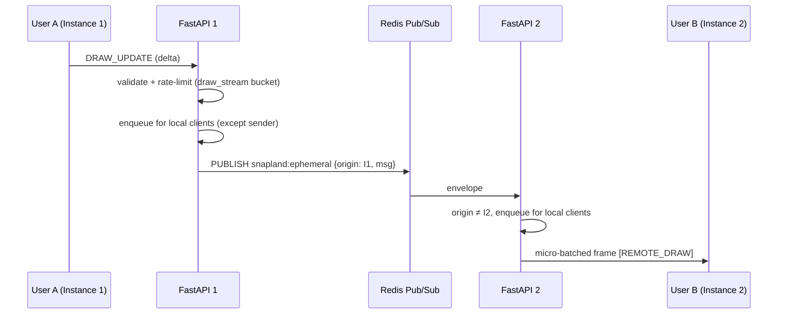

**Durable events (`AREA_*`):** emitted for **every** mutation regardless of entry point (WS `DRAW_COMMIT` or HTTP `POST/PUT/DELETE /areas`), only after the DB transaction commits. Every instance follows the stream with `XREAD BLOCK` and enqueues to its local clients; the sender receives its own `AREA_SAVED` through the same path (it carries `shapeId`).

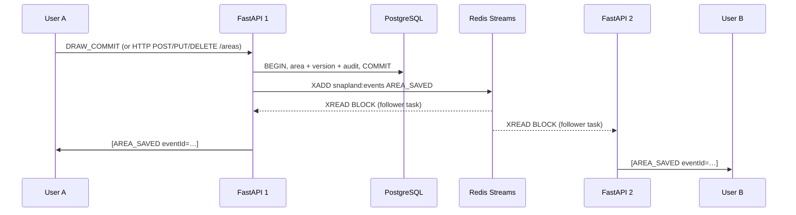

Streams are trimmed by age (`XTRIM MINID`, 5 minutes) with a hard cap of ~10 000 entries.

### 9.3 Outbound Queue, Coalescing and Backpressure

Each connection owns a bounded `asyncio.Queue(maxsize=256)` and a writer task:

- The writer waits up to **50 ms** (micro-batch window) — or flushes immediately if a durable event is queued — drains the queue and sends **one array frame**. Messages are serialized once per instance (`orjson`) and the bytes are joined per client, so serialization cost does not scale with the number of recipients.
- **Coalescing:** `CURSOR_MOVE` keeps only the latest per user; contiguous `REMOTE_DRAW` updates for the same `shapeId` are merged into a single `append`.
- **Overflow:** ephemeral messages are dropped oldest-first (`ws_messages_dropped_total{reason="queue_full"}`). When a durable message arrives and the queue is full, the oldest ephemeral message is evicted to make room. Only if the queue is entirely saturated with durable messages is the connection closed with code `1013`; the client reconnects and catches up (§9.7).
- **Inbound limits:** max frame size 64 KB, max 5 concurrent connections per user.

### 9.4 Rate Limiting

"Drawing actions" (assignment: max 50 per minute per user) are defined precisely; high-frequency streaming traffic is throttled separately so normal drawing never trips the limit.

| Bucket | Counts | Limit | On exceed |
|---|---|---|---|
| `draw_action` | `DRAW_START`, `DRAW_COMMIT`, `DRAW_CANCEL`, HTTP `POST/PUT/DELETE /areas` (WS and HTTP share the bucket) | **50 / min / user** | WS: `ERROR{RATE_LIMITED, retryAfterMs}`, message dropped, no disconnect · HTTP: 429 + `Retry-After` |
| `draw_stream` | `DRAW_UPDATE` | 900 / min / user (15 Hz sustained) | Dropped; `ERROR` sent at most once per 10 s |
| *(throttle, no bucket)* | `CURSOR_MOVE` | 1 per 100 ms / user | Silently dropped |
| `http` | all other HTTP | 100 / min / user (per IP for unauthenticated routes; 20 / min on `/auth/login` and `/auth/register`) | 429 + `Retry-After` |

Algorithm: Redis sorted-set sliding window executed as a **single Lua script** (`ZREMRANGEBYSCORE` + `ZCARD` + `ZADD`) so the check is atomic across instances; key `rate:{bucket}:{user_id}`. Nginx `limit_req` per IP is a coarse backstop.

### 9.5 Presence

- Redis sorted set `presence:global`: member `userId:connId`, score = last heartbeat (unix ms). In addition, `presence:conns:{userId}` set tracks active connections per user with O(1) cardinality check (`SCARD`) instead of scanning `presence:global`. Display names are cached in hash `presence:names`.
- On connect, `add_connection` registers the connection. The server sends `PRESENCE_SNAPSHOT` to the joiner, and if this was the user's first active connection, broadcasts `USER_JOINED` locally (except to sender) and publishes to `ephemeral_bus` (with `origin=INSTANCE_ID`).
- Heartbeat: local connections are heartbeated every 10 s in a single Redis pipeline batch (`heartbeat_batch`); an entry older than 30 s is considered dead.
- On disconnect, the server removes the connection. If no active connections remain for that user (`remove` returns True), it broadcasts `USER_LEFT` locally and publishes to `ephemeral_bus`.
- **Crash recovery:** a reaper task on every instance (guarded by a `SET NX PX` lock with `px=8000` so only one instance runs per tick) identifies expired entries from `presence:global`, cleans up orphan keys, and announces `USER_LEFT` via `ephemeral_bus` and local broadcast for dead users.

### 9.6 Connection Lifecycle & Security

1. Client obtains a single-use ticket: `POST /auth/ws-ticket` (Bearer) → `{ticket}`, stored in Redis (`ws_ticket:{ticket}`) with a 30 s TTL.
2. Client opens `wss://…/ws?ticket=…&lastEventId=…`. The server checks the `Origin` header against `WS_ALLOWED_ORIGINS` (when configured, preventing cross-site WebSocket hijacking), redeems the ticket atomically (`GETDEL`), and rejects with an immediate close code before accepting the upgrade: `4003` (forbidden origin) or `4001` (invalid/reused ticket).
3. The connection is initially connected without registering into the live broadcast pool (`register=False`). It receives `PRESENCE_SNAPSHOT` and replays any pending durable events (`read_since(lastEventId)`); only once replay completes is it added to the live broadcast pool, preventing out-of-order event interleaving.
4. The connection lives at most as long as an access token (15 min); the server then closes with code `4401`. The client fetches a fresh ticket and reconnects transparently (this does not count as a failure). Logout / session revocation closes the user's sockets via a Redis control message.
5. Ping/pong every 30 s; the connection is closed if no pong arrives within 10 s.

### 9.7 Graceful Degradation & Catch-up

1. Reconnect with exponential backoff **plus jitter**: 1 s → 2 s → 4 s → 8 s → 16 s → 30 s (cap).
2. On every (re)connect the client sends `lastEventId`. The server replays newer `AREA_*` events from the stream (`read_since(lastEventId)`). If `lastEventId` is `0-0`, it replays from stream inception. If `lastEventId` is trimmed or invalid, it sends `RESYNC_REQUIRED` and the client refetches the viewport over HTTP.
3. After **5 consecutive failures** the client enters `polling`: read-only HTTP viewport refetch every 5 s (saving areas still works over HTTP), while retrying the WebSocket every 30 s.
4. Background tasks (`run_ephemeral_subscriber`, `run_stream_follower`, `run_presence_reaper`, `run_presence_heartbeat`) run resiliently in `lifespan` with exponential backoff recovery loops (capped at 10s). If Redis is unavailable or tasks fail, status is reflected in `/health/ready` under `background_tasks` reporting `degraded`, while local fan-out continues.

---

## 10. API Design

### 10.1 REST Endpoints

| Method | Path | Description | Auth |
|---|---|---|---|
| `POST` | `/api/v1/auth/register` | Register | Public (rate-limited) |
| `POST` | `/api/v1/auth/login` | Returns access token; sets `refresh_token` cookie (`httpOnly; Secure; SameSite=Strict; Path=/api/v1/auth`) | Public (rate-limited) |
| `POST` | `/api/v1/auth/refresh` | Rotate refresh token (cookie) and issue a new access token | Refresh cookie |
| `POST` | `/api/v1/auth/logout` | Revoke session, clear cookie, close the user's sockets | Refresh cookie |
| `POST` | `/api/v1/auth/ws-ticket` | Issue one-time WebSocket ticket (30 s) | Bearer |
| `GET` | `/api/v1/areas?bounds=minLng,minLat,maxLng,maxLat&zoom=12&limit=500` | Areas in viewport → `{areas, truncated}` | Bearer |
| `POST` | `/api/v1/areas` | Create area | Bearer |
| `GET` | `/api/v1/areas/{id}` | Get by ID | Bearer |
| `PUT` | `/api/v1/areas/{id}` | Update (OCC, body carries `version`) | Bearer |
| `DELETE` | `/api/v1/areas/{id}` | Soft delete | Bearer |
| `GET` | `/api/v1/areas/{id}/history` | Version history | Bearer |
| `GET` | `/api/v1/users/me` | Profile | Bearer |
| `GET` | `/health/live` | Liveness: process is up | Public |
| `GET` | `/health/ready` | Readiness: DB + Redis + background tasks (503 if DB down; `degraded` if Redis or any background task is down). `/health` is an alias. | Public |
| `GET` | `/health/db` | Runs `EXPLAIN` on the viewport query and verifies the spatial index is used | Internal |
| `GET` | `/metrics` | Prometheus | Internal |
| `WS` | `/ws?ticket=…&lastEventId=…` | WebSocket | One-time ticket |

Any authenticated user may edit any area — the product is collaborative and concurrent edits are arbitrated by OCC (§14). Role-based permissions are future work.

### 10.2 Standard Error Response

All error responses follow this shape (FastAPI's default 422 is remapped to 400 `VALIDATION_ERROR` by `error_handler.py`):
```jsonc
{
  "error": "CONFLICT",                                   // machine-readable error code (enum)
  "message": "Area was modified by another user",        // human-readable
  "details": { "current_version": 3, "current_area": { /* full Area at version 3 */ } }
}
```

| HTTP Status | Error Code | When |
|---|---|---|
| 400 | `VALIDATION_ERROR` | Invalid request body, bad or invalid polygon (`details.reason`, e.g. `SELF_INTERSECTION`) |
| 401 | `UNAUTHORIZED` | Missing or expired JWT / refresh cookie |
| 403 | `FORBIDDEN` | Valid JWT but not allowed (e.g. bad `Origin`) |
| 404 | `NOT_FOUND` | Area/user not found |
| 409 | `CONFLICT` | OCC version mismatch — includes the current area, so the client needs no extra fetch |
| 413 | `PAYLOAD_TOO_LARGE` | Body > 1 MB |
| 429 | `RATE_LIMITED` | Bucket exceeded (§9.4); `Retry-After` header set |
| 500 | `INTERNAL_ERROR` | Server error — no details in production response (logged internally with `request_id`) |
| 503 | `UNAVAILABLE` | Readiness failure |
| 504 | `TIMEOUT` | Handler exceeded 30 s |

---

## 11. Frontend Architecture

### 11.1 Component Tree

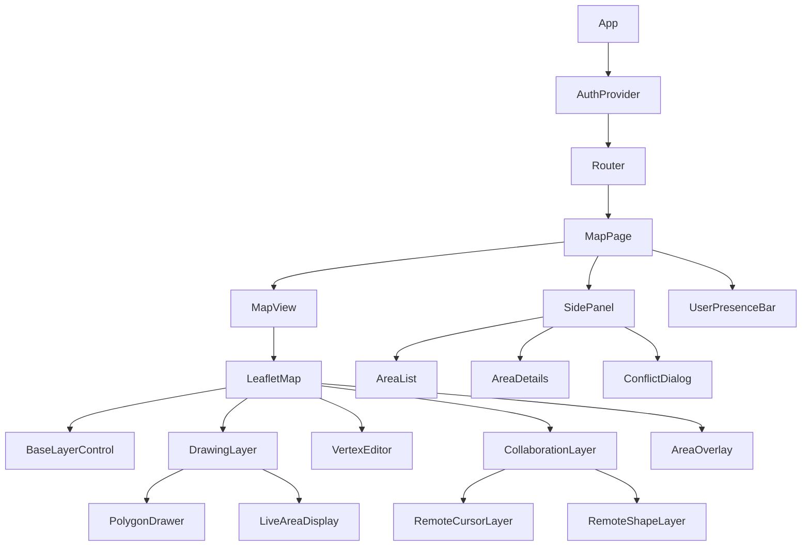

### 11.2 Custom Polygon Drawing (No Third-Party Plugins)

The assignment requires *"No third-party plugins for the collaborative features."* This means no `leaflet-draw`, `leaflet-pm`, or similar drawing plugins.

**Implementation approach:**
- **Point collection**: `map.on('click', (e) => addPoint(e.latlng))` — each click appends to a coordinate array. Consecutive identical points are discarded.
- **Live preview**: in-progress shape rendered as an open `L.Polyline` plus a dashed closing segment, updated on each point; a tooltip shows the live area as **"≈ x km²"** (Turf estimate, §11.6).
- **Close polygon**: `dblclick`, `Enter`, or a click on the first vertex. While drawing, `map.doubleClickZoom` is **disabled** (otherwise a double-click zooms the map), and the two `click` events that precede a `dblclick` must not create a duplicate vertex (handled by the identical-point filter). The closing action requires ≥ 3 distinct vertices and no self-intersection (`@turf/kinks` pre-check; the server re-validates).
- **Panes**: drawings and saved areas live in dedicated Leaflet panes above `tilePane`, independent of the base layer (§11.4).
- **Edit existing**: select a saved polygon → each vertex becomes a draggable **`L.Marker` with an `L.divIcon`** (`L.CircleMarker` is *not* draggable) → on `dragend` update the ring; saving sends `PUT` with the area's `version`.
- **Delete**: select polygon → delete button in AreaPanel → confirm → soft delete via API.
- **Cancel**: `Escape` or cancel button → discard points and send `DRAW_CANCEL`.
- **Sync**: the local shape is streamed to peers as deltas (§9.1), throttled to ~15 Hz.

This satisfies the no-plugin requirement while keeping the drawing UX simple and testable.

### 11.3 Mock → Real Service Swap

Phase 1 uses mocks injected via React Context. Phase 3 swaps to real implementations — **zero component changes needed**:

```typescript
// Phase 1: inject mocks
<ApiContext.Provider value={{ areaApi: mockAreaApi, wsService: mockWebSocketService }}>
  <App />
</ApiContext.Provider>

// Phase 3: inject real implementations (same interface)
<ApiContext.Provider value={{ areaApi: realAreaApi, wsService: realWebSocketService }}>
  <App />
</ApiContext.Provider>
```

### 11.4 Map Layer Strategy

Saved areas and in-progress drawings are Leaflet vector layers in their own panes; they are positioned from WGS84 `LatLng` values and are **independent of the base tile layer**. Switching the base layer therefore cannot move them — the design goal is to make that a structural guarantee rather than a "restore" step.

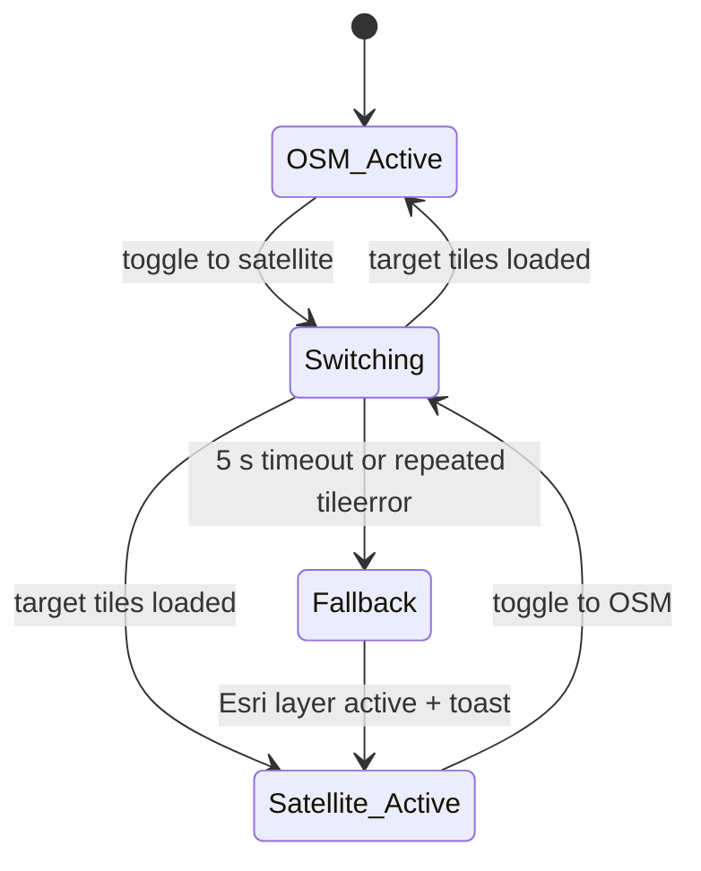

**Switch procedure (`LayerManager`):**
1. Add the target tile layer to `tilePane` at `opacity: 0` (map center, zoom and all overlay layers untouched).
2. On the layer's `load` event, cross-fade (~300 ms): target → 1, current → 0.
3. Remove the old layer. In-progress drawing points are never touched (they live in `useDrawing` state, WGS84).
4. If `load` does not fire within 5 s, or `tileerror` exceeds a threshold, switch to the fallback layer and show a notice.
5. The satellite layer sets `maxNativeZoom` 19; the map keeps `maxZoom` 19 so Leaflet upscales tiles beyond the source's native zoom instead of showing blanks.

Invariants covered by unit + E2E tests: overlay `LatLng`s are identical before/after a switch; map center/zoom are unchanged; drawing can continue across a switch.

**Satellite layer integration & GovMap findings (ADR-004):**

> [!NOTE]
> Per the project specification, `govmap.gov.il` was evaluated in Phase 1 as the candidate satellite imagery source. The evaluation (recorded in ADR-004) revealed that the open endpoint `https://cdnil.govmap.gov.il/xyz/heb/{z}/{x}/{y}.png` serves standard vector street/administrative basemap tiles in Web Mercator (EPSG:3857) rather than satellite/aerial imagery. Furthermore, the open GeoServer WMS endpoint contains vector cadastral layers only.
>
> Consequently, **Esri World Imagery** is implemented as the primary satellite base layer, providing high-resolution global aerial imagery natively in Web Mercator (EPSG:3857). GovMap is maintained as an alternate/fallback basemap layer, and the lack of an unauthenticated open GovMap aerial imagery XYZ service is documented as a known limitation.

```javascript
// Primary satellite layer (ADR-004: Esri World Imagery in standard Web Mercator XYZ)
const SATELLITE_URL = import.meta.env.VITE_SATELLITE_TILE_URL
  ?? 'https://server.arcgisonline.com/ArcGIS/rest/services/World_Imagery/MapServer/tile/{z}/{y}/{x}';

const satelliteLayer = L.tileLayer(SATELLITE_URL, {
  maxZoom: 19,
  attribution: '© Esri, Maxar, Earthstar Geographics',
});

// Fallback basemap layer if satellite tiles fail
const fallbackLayer = L.tileLayer(
  'https://cdnil.govmap.gov.il/xyz/heb/{z}/{x}/{y}.png',
  { maxZoom: 19, maxNativeZoom: 19, attribution: '© Survey of Israel — GovMap' }
);
```

**Phase 1 verification findings summary (ADR-004):**
1. Tested sample tile over Israel (`z=10, x=612, y=416`): responded HTTP 200 with PNG content type.
2. Visual and metadata inspection: verified as vector street basemap, **not** aerial/satellite photography.
3. Tile grid: Web Mercator (EPSG:3857), eliminating the need for client-side ITM (EPSG:2039) reprojection via `proj4`.
4. Decision outcome: Esri World Imagery configured as primary satellite layer (`VITE_SATELLITE_TILE_URL` default); GovMap retained as fallback; limitation documented in HLD, ADR-004, and README.

### 11.5 WebSocket State Machine

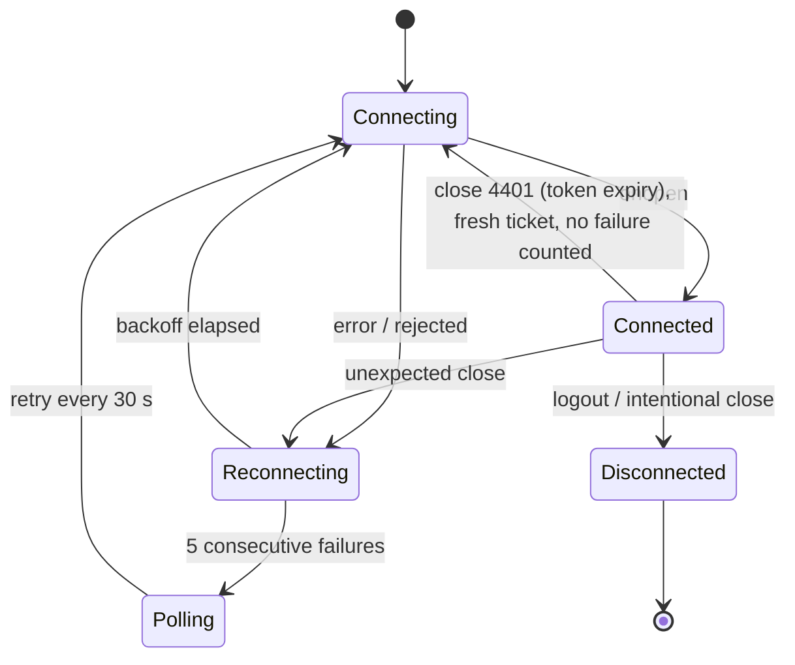

`Polling` = degraded mode: HTTP viewport refetch every 5 s, saving still works over HTTP, live previews are unavailable.

### 11.6 Projections & Coordinate Handling

| CRS | EPSG | Role in Snapland |
|---|---|---|
| WGS84 | 4326 | Storage (PostGIS), REST, WebSocket payloads, GeoJSON (`[lng, lat]`) |
| Web Mercator | 3857 | Leaflet's default CRS and the OSM/Esri tile grid — **display only**, never stored |
| Israel Transverse Mercator (ITM) | 2039 | Israel's national grid (planar metres) and the native CRS of much govmap data. Used only (a) if ADR-004 shows the satellite tiles are ITM-based, and (b) in tests as a planar cross-check (`ST_Transform(geom, 2039)`) |

Rules:
- **Axis order:** Leaflet uses `[lat, lng]`; GeoJSON and PostGIS use `[lng, lat]`. Conversion happens only in `ProjectionUtils` / `geoUtils` (unit-tested). DTOs use named `{lat, lng}` fields so the order is never implicit.
- **Never compute area on 3857.** At 32°N, Web Mercator inflates area by 1/cos²φ ≈ 1.39×.
- **Authoritative area** = PostGIS `geography` (WGS84 ellipsoid). The browser's Turf estimate assumes a sphere and can differ by a few tenths of a percent, so live values are shown as **"≈"** and replaced with the server value on save. A unit test compares Turf against `pyproj.Geod` on reference polygons with a documented tolerance (0.5%).
- **Layer switching does not transform data:** polygons stay WGS84 `LatLng`s; Leaflet projects them for whichever CRS the map uses.
- **Leaflet fixes the CRS per map instance.** If an ITM-based imagery source were mandatory, switching between OSM (3857) and ITM tiles would require either recreating the map or reprojecting one of the layers (via `proj4` + `Proj4Leaflet`, which is infrastructure, not a collaborative-feature plugin). The default design avoids this by keeping both layers in 3857; ADR-004 records the decision.

---

## 12. Security Design

### 12.1 Auth Flow

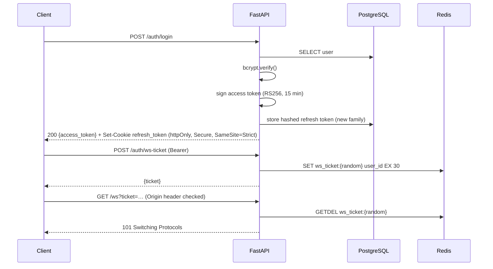

### 12.2 Security Measures

| Concern | Measure |
|---|---|
| Password | bcrypt cost = 12; login/register rate-limited (20/min per IP) |
| Access token | JWT RS256, 15 min, held in memory only (never `localStorage`) |
| Refresh token | 7 d, random, stored **hashed**, `httpOnly; Secure; SameSite=Strict` cookie scoped to `/api/v1/auth`; **rotated on every use**; presenting an already-rotated token revokes the whole token family (theft detection); session restored on page load via `/auth/refresh` |
| WS auth | One-time 30 s ticket redeemed atomically (`GETDEL`) before the upgrade; no JWT in URLs or logs; `Origin` allowlist check; connection lifetime capped at the access-token TTL |
| CORS | Strict origin allowlist with credentials; in docker-compose the app is same-origin behind Nginx |
| Input | Pydantic on all request bodies; validation limits in §12.3; string fields stripped of control characters; React escapes on render |
| Polygon | Server validates and closes the ring, `ST_IsValid` + reason, limits below |
| SQL | SQLAlchemy parameterized queries only; the single raw-SQL path (viewport/OCC) uses bind parameters |
| Rate limiting | Redis sliding window, atomic Lua script (§9.4) + Nginx `limit_req` per IP |
| Payload size | HTTP body ≤ 1 MB (`client_max_body_size`), WS frame ≤ 64 KB, ≤ 5 WS connections per user |
| Audit | Area mutations logged **in the same DB transaction**; auth events logged asynchronously |
| Logging hygiene | Never log passwords, tokens, tickets or cookies; access log for `/ws` omits the query string |
| TLS | Terminated at Nginx; internal HTTP on the private network |
| Timeouts | 30 s handler timeout (504), Postgres `statement_timeout`, WS ping/pong |

### 12.3 Input Validation Limits (single definition — see §3.2)

| Field | Rule |
|---|---|
| `lat` / `lng` | Finite numbers (NaN/Infinity rejected); lat ∈ [−90, 90], lng ∈ [−180, 180] |
| Polygon vertices | 3 to 1000 distinct vertices; consecutive duplicates removed; ring closed server-side |
| Geometry | `ST_IsValid` (no self-intersection), area ≥ 1 m², area ≤ `MAX_AREA_KM2` (default 25 000) |
| `name` | 1–100 characters after trimming, no control characters |
| Request size | HTTP body ≤ 1 MB; WS frame ≤ 64 KB |

---

## 13. Caching Strategy

```
L1: In-process LRU (per instance, 512 items, 30 s TTL)
    → static config, JWT public key
      (decoded JWTs are NOT cached, so revocation and expiry take effect immediately)

L2: Redis (shared)
    → Viewport queries: key = "areas:v{epoch}:z{zoomBucket}:{snappedBbox}:{limit}", TTL 10 s
    → User profile:     key = "user:{id}", TTL 5 min
```

- **Bbox snapping:** the service snaps the requested bbox *outward* to a 0.01° grid and queries (and caches) the snapped box, so neighbouring viewports share cache entries. The client filters what it draws; `limit` applies to the snapped box.
- **Invalidation by epoch:** any area mutation does `INCR areas:epoch` (O(1), visible to all instances). Keys embed the epoch, so older entries simply stop being read and expire via TTL. No `SCAN`/pattern deletes. Trade-off: any mutation invalidates all viewport entries — acceptable at this scale; per-tile epochs are the documented refinement.
- **Pattern:** cache-aside (read → miss → DB → write cache). Cached values are the serialized `AreaPage` including `truncated`.

---

## 14. Conflict Resolution

Different users drawing **different new shapes** never conflict. Conflicts arise only when several users **edit the same existing area**; these are arbitrated by optimistic concurrency control (OCC).

```
1. Client loads area at version N
2. Client sends PUT /areas/{id} with version: N
3. Server: UPDATE ... WHERE id=? AND version=N        (§8.3)
4. Success: version N+1, AREA_UPDATED published to everyone
5. rowcount = 0 → 409 CONFLICT with details.current_area (full latest state)
6. Client shows ConflictDialog using details.current_area — no extra fetch:
     [Accept Remote]   discard local edit, adopt current_area
     [Force Overwrite] re-send local geometry against current_version (history keeps both versions)
     [Save as New]     POST the local geometry as a new area
```

**Proactive detection.** When an `AREA_UPDATED` / `AREA_DELETED` event arrives for an area the local user is currently editing, the client marks the local edit stale and opens the ConflictDialog immediately instead of waiting for a failed save. Only the rejected editor receives the 409; everyone else learns of the winning change through the normal `AREA_UPDATED` event. `occ_conflicts_total` counts 409s.

---

## 15. Scalability & Horizontal Scaling

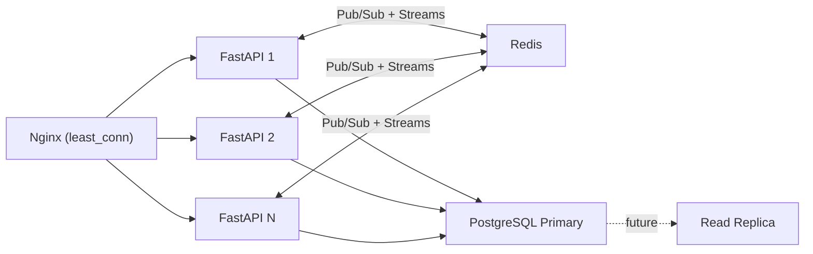

| Concern | Solution |
|---|---|
| WS connection affinity | **Not required.** A WebSocket stays on the instance that accepted it; fan-out goes through Redis, so any instance can serve any client. Nginx uses `least_conn`, long `proxy_read_timeout`, and connection draining on deploy. (`ip_hash` is avoided: it skews badly behind NAT.) |
| Cross-instance fan-out | Ephemeral: Redis Pub/Sub with `origin` filtering. Durable: Redis Streams read by every instance. |
| Message queuing | Per-connection bounded queues with coalescing and micro-batching (§9.3); Streams provide the durable, replayable queue for `AREA_*` events. |
| Stateless app | No in-memory session state: JWT + Redis (tickets, presence, rate limits, cache). Each instance has a unique `INSTANCE_ID`. |
| DB connections | asyncpg pool per instance; PgBouncer documented for larger fleets |
| DB read scaling | Read replica documented, **not built** — replication lag would need read-your-writes routing after a user's own write |
| Migrations | One-shot `migrate` service, never per replica |
| Redis availability | Single node in v1 (degrades gracefully, §9.7); Sentinel/Cluster documented. Pub/Sub is loss-tolerant by design; only Streams data matters and the client re-syncs over HTTP. |
| Higher-volume upgrade path | Viewport-scoped fan-out (per-tile channels), then Kafka/NATS at > ~10k concurrent users |

**Load model (Phase 4A measurements & architecture targets):**

| Scenario | Status & Measurement |
|---|---|
| 100 connected users, 10 actively drawing at 15 Hz, everyone sending cursors at 10 Hz | inbound ≈ 1 150 msg/s (design target model) |
| Outbound without batching (≈ 99 recipients each) | ≈ 114 000 msg/s — not viable in Python (theoretical unbatched baseline) |
| Outbound with 50 ms micro-batch frames + coalescing | ≤ 20 frames/s per client ≈ 2 000 frames/s cluster-wide (design architecture) |
| Viewport query (10 000 polygons in region, GiST) | **measured p95 = 6.98 ms** at the DB (target: < 10 ms) |
| Viewport query (100 000 polygons in region, GiST) | **measured p95 = 36.01 ms** at the DB (Zoom 14), **p95 = 9.47 ms** (Zoom 17) |
| Viewport query (with Redis L2 cache) | **measured p95 = 1.37 ms - 1.58 ms** across all zoom levels |
| WebSocket connection success (50 / 100 / 200 concurrent users) | **measured 100.0%** connection success, 0 dropped messages under normal load |
| HTTP p99 | target < 200 ms |
| Ephemeral end-to-end fan-out latency (cluster-wide) | target p95 < 100 ms |


---

## 16. Observability & Monitoring

### Health Checks
```jsonc
// GET /health/live  → 200  { "status": "ok" }
// GET /health/ready → 200 | 503
{ "status": "healthy" /* or "degraded" | "unhealthy" */, "database": "ok", "redis": "ok",
  "instance_id": "backend-1", "timestamp": "...", "version": "1.0.0" }
// GET /health/db (internal): EXPLAIN of the viewport query must reference areas_geom_gist
```

### Prometheus Metrics
| Metric | Type |
|---|---|
| `http_requests_total` | Counter (method, **route template**, status) |
| `http_request_duration_seconds` | Histogram (method, route template) |
| `ws_connections_active` | Gauge |
| `ws_messages_total` | Counter (type, direction) |
| `ws_messages_dropped_total` | Counter (reason: `queue_full`, `throttled`, `rate_limited`) |
| `ws_outbound_queue_depth` | Histogram |
| `area_operations_total` | Counter (create/update/delete) |
| `cache_requests_total` | Counter (layer: L1/L2, result: hit/miss) — hit ratio computed in PromQL |
| `rate_limit_hits_total` | Counter (bucket) |
| `occ_conflicts_total` | Counter |
| `viewport_query_duration_seconds` | Histogram |
| `db_pool_connections` | Gauge (state: in_use/idle) |

Route templates (not raw paths) are used as labels to keep cardinality bounded.

### Structured Logs
```jsonc
{ "timestamp": "...", "level": "INFO", "logger": "area_service",
  "message": "Area saved", "user_id": "uuid", "area_id": "uuid",
  "area_km2": 1.423, "duration_ms": 12, "request_id": "uuid", "instance_id": "backend-1" }
```
WS connections log with a `conn_id` in place of `request_id`.

---

## 17. Testing Strategy

### 17.1 Test Pyramid

```
        ▲  E2E (Playwright)
       ███    — critical user flows (draw, collaborate, layer switch)
      ███████
     ███████████  Integration (pytest + httpx)
    ███████████████   — API endpoints, WS protocol, DB queries
   ███████████████████
  ██████████████████████  Unit
 ████████████████████████████  — services, spatial utils, hooks, stores
```

### 17.2 Backend Test Coverage Requirements

| Layer | Coverage Target | Tools |
|---|---|---|
| Core services | ≥ 90% line coverage | pytest + pytest-asyncio |
| Repositories | ≥ 80% (integration with test DB) | pytest + asyncpg test pool |
| API routes | ≥ 80% | httpx AsyncClient |
| WebSocket | Key message flows | pytest-asyncio + WS test client |
| Spatial logic | 100% (area calc, validation) | pytest |

**Key test scenarios:**
- `SpatialService.calculate_area_km2` — known polygons match `pyproj.Geod` references (e.g. a 0.01° × 0.01° square at 32°N ≈ 1.05 km²)
- `SpatialService.validate_polygon` — self-intersection, < 3 distinct vertices, > 1000 vertices, NaN/out-of-range coordinates, oversized area → `valid=False` with the right `reason`
- `AreaService.update_area` — OCC conflict → raises `ConflictError` carrying the current area
- `AreaService.get_areas_in_bounds` — cache hit vs. miss; epoch bump invalidates; `truncated` set when > limit rows
- `RateLimiter.check_limit` — 50th `draw_action` allowed, 51st rejected with `retry_after_ms`; window slides; concurrent callers cannot exceed the limit (Lua atomicity)
- Outbound queue — cursor coalescing (latest wins), contiguous `REMOTE_DRAW` merge, ephemeral overflow drops oldest, durable overflow closes the connection with 1013
- Delta protocol — `fromIndex` mismatch marks preview stale (frontend); server rejects malformed deltas
- `GET /areas?bounds=...&zoom=...` — returns only polygons intersecting the bbox; simplification applied at low zoom
- Auth — refresh rotation; reuse of a rotated refresh token revokes the family; WS ticket is single-use and expires after 30 s
- WS `DRAW_COMMIT` and HTTP `POST /areas` → both produce `AREA_SAVED` on all clients across two instances
- Presence — `PRESENCE_SNAPSHOT` on join; `USER_LEFT` after a simulated instance crash (heartbeat expiry + reaper)
- Reconnect catch-up — events after `lastEventId` are replayed; an expired `lastEventId` yields `RESYNC_REQUIRED`

### 17.3 Frontend Test Coverage Requirements

| Layer | Coverage Target | Tools |
|---|---|---|
| `useDrawing` hook | ≥ 90% | Vitest + Testing Library |
| `useWebSocket` hook | State machine transitions | Vitest |
| `geoUtils` / `areaCalculation` | 100% | Vitest |
| `LayerManager` | Layer swap logic | Vitest |
| E2E flows | Draw + save + collaborate | Playwright |

### 17.4 Test Infrastructure

```python
# backend/tests/conftest.py
@pytest.fixture
async def db_session():
    # Separate test DB with PostGIS
    # Run alembic migrations before the test session
    # Roll back after each test

@pytest.fixture
def mock_area_repository() -> IAreaRepository:
    # In-memory mock implementing the Protocol
    return MockAreaRepository()

@pytest.fixture
def area_service(mock_area_repository, mock_spatial_service, mock_cache, mock_event_publisher, mock_audit):
    return AreaService(
        repo=mock_area_repository,
        spatial=mock_spatial_service,
        cache=mock_cache,
        events=mock_event_publisher,
        audit=mock_audit,
    )
```
Unit tests use `fakeredis` (Pub/Sub and Streams supported); integration and multi-instance tests run against a real Redis container. Lua-script atomicity tests must use real Redis.

### 17.5 Performance & Load Testing

- **Dataset:** `scripts/seed_db.py --polygons 10000` (and a 100 000 stress run) generates realistic polygons across Israel.
- **Query benchmark:** `EXPLAIN (ANALYZE, BUFFERS)` and latency percentiles for the viewport query at several zooms; results and index evidence recorded in `docs/performance.md`.
- **WebSocket load test:** `loadtest/ws_collab.js` (k6) — N virtual users obtain tickets, connect, stream drawing deltas and cursors, and measure end-to-end fan-out latency and dropped-message counters, against `docker compose up --scale backend=2` (or `./scripts/setup.sh`) with 2 backend replicas. Scenarios: 50 / 100 / 200 users.
- Reported numbers are measured on the developer machine and labelled as such; §15 lists targets, not results.

---

## 18. Phased Implementation Plan

> [!NOTE]
> Phases 1–4 are designed for **parallel agent execution**. Within each phase, tasks marked 🟦 (backend) and 🟩 (frontend) can run simultaneously. Phase 0 must complete before anything else.

> [!IMPORTANT]
> **Prompt conventions (apply to every phase).**
> - The working directory is the repository root; all paths are relative to it.
> - `docs/hld.md` (this document) is the contract. Prompts reference its sections instead of restating them, so they cannot drift from it. Read the referenced sections before writing code.
> - Do not change a Protocol / TypeScript interface from §6 without recording the change in the phase report.
> - If reality contradicts the HLD (e.g. the govmap check in Phase 1), record the finding in the matching ADR and report it — do not silently deviate.

---

### Phase 0 — Repository & Scaffold ⚡

**Goal**: Working repo with CI, directory structure, Docker, and empty but runnable services.
**Duration**: ~2-3 hours
**Agent**: Single agent (serial — foundation for all others)

---

#### 📋 Phase 0 Agent Prompt

```
You are setting up the Snapland collaborative GIS project from scratch.

CONTEXT:
- Monorepo at the repository root (all paths relative to it)
- Stack: Python 3.12 + FastAPI (backend), React 18 + TypeScript + Vite (frontend)
- Contract: docs/hld.md. Read §3 (principles), §4 (structure), §5 (stack), §6 (interfaces) first.
- SOLID: every service/repo has a corresponding Python Protocol in core/interfaces/
- DRY: the backend is the source of truth for API/WS types (generated to TypeScript in Phase 2).
  Phase 0 only hand-writes the BOOTSTRAP types of HLD §6.3.

TASK: Create the complete repository scaffold matching the tree in HLD §4 exactly
(do not create cd.yml; do not create files that are not in the tree except the ones listed below).

DELIVERABLES:
1. All directories and placeholder files from HLD §4 (every directory under
   backend/src/snapland/ has an __init__.py)
2. backend/pyproject.toml, runtime deps: fastapi, uvicorn[standard], sqlalchemy[asyncio], asyncpg,
   alembic, geoalchemy2, redis[hiredis] (redis.asyncio — NOT aioredis), PyJWT[crypto], bcrypt
   (NOT python-jose / passlib), pydantic-settings, shapely, pyproj, orjson, structlog,
   prometheus-client, apscheduler.
   dev deps: pytest, pytest-asyncio, pytest-cov, httpx, fakeredis, ruff, mypy.
3. frontend/package.json: react, react-dom, typescript, vite, leaflet, @types/leaflet,
   @turf/area, @turf/kinks, proj4, zustand, axios, vitest, @testing-library/react,
   @playwright/test. (Use the modular @turf/* packages, not the legacy "turf" monolith.)
4. infra/docker-compose.yml: postgres (postgis/postgis:16-3.4, healthcheck), redis (7-alpine,
   healthcheck), migrate (one-shot: alembic upgrade head), backend (depends_on migrate completed
   successfully + redis healthy; env INSTANCE_ID defaulting to the container hostname), frontend,
   nginx. Prometheus/Grafana are added in Phase 4B.
5. .env.example listing every variable NAME with a placeholder and a one-line comment
   (DATABASE_URL, REDIS_URL, JWT_PRIVATE_KEY, JWT_PUBLIC_KEY, ACCESS_TOKEN_EXPIRE_MINUTES,
   REFRESH_TOKEN_EXPIRE_DAYS, CORS_ORIGINS, WS_ALLOWED_ORIGINS, INSTANCE_ID, MAX_AREA_KM2,
   MAX_POLYGON_VERTICES, SATELLITE tile URL for the frontend as VITE_SATELLITE_TILE_URL, ...)
6. ALL Protocol interfaces written in full (not stubs), exactly as HLD §6.1:
   repositories.py (AreaPage, IAreaReadRepository, IAreaRepository, IUserRepository,
   ISessionRepository), services.py (IAreaService, PolygonValidation, ISpatialService,
   IAuthService, RateLimitResult, IRateLimiter, IEventPublisher), cache.py (ICacheRepository),
   realtime.py (Envelope, CatchUp, IEphemeralBus, IEventStream, IPresenceStore).
   Domain dataclasses/Pydantic models they reference (Coordinate, Area, AreaVersion, User, Session,
   TokenResponse, DomainEvent, WsMessage, PresenceUser) exist as minimal but real types.
7. ALL bootstrap TypeScript types and frontend interfaces written in full, exactly as HLD §6.2 / §6.3
8. Service stubs that reference the Protocols in their __init__ signatures (DI-ready)
9. Alembic initialized (alembic init migrations), env.py wired to async engine + DATABASE_URL
10. scripts/gen_types.py as a documented stub (implemented in Phase 2)
11. docs/hld.md (copy of the HLD) and docs/adr/001..004 stubs with title + "Status: proposed"
12. FastAPI boots (uvicorn) with GET /health/live returning {"status":"ok"}
13. React app boots (vite dev) with a placeholder "Snapland" page
14. CI workflow .github/workflows/ci.yml: on PR → ruff → mypy → pytest → tsc → vitest

CONSTRAINTS:
- All Protocol interfaces must be written before service stubs
- No business logic yet — just structure
- Verify imports work across packages before marking done
- Run `docker compose up` successfully before marking done
```

---

### Phase 1 — Frontend Foundation (Mock Backend) 🟩

**Goal**: Full working UI with map, drawing, editing, layer switching — wired to mock services.
**Depends on**: Phase 0
**Parallel with**: Phase 2 (single frontend agent)

---

#### 📋 Phase 1 Agent Prompt

```
You are building the Snapland frontend (React + TypeScript + Leaflet.js).
The backend does NOT exist yet — use the mock implementations in src/api/mock/.

CONTEXT:
- Working directory: frontend/ (repo root is one level up)
- Contract: docs/hld.md — read §6.2/6.3 (interfaces), §9.1 (WS protocol), §11 (frontend, layers,
  projections) before coding
- Interfaces are already defined in src/api/interfaces/ — implement them, do not change them
- SOLID: components only render, hooks own state logic, services own side effects
- No business logic in JSX — all in hooks/services
- Vitest tests for every hook and utility

TASK — implement in this order:

0. VERIFY THE SATELLITE SOURCE (HLD §11.4 checklist, then write docs/adr/004):
   - Fetch a sample tile over Israel (z=10, x=612, y=416) from
     https://cdnil.govmap.gov.il/xyz/heb/{z}/{x}/{y}.png and inspect it: status, content type,
     is it AERIAL IMAGERY or a street basemap? is the tile grid standard Web Mercator?
   - Check access constraints (403/whitelisting/CORS/token) from localhost.
   - Record URL, native zoom range, CRS, constraints, and the decision in docs/adr/004.
   - Make the URL configurable: VITE_SATELLITE_TILE_URL (default = verified URL, or the Esri
     fallback if govmap is not usable), plus maxNativeZoom from the findings.
   - If proj4/ITM turns out to be necessary, STOP and report before implementing a custom CRS.

1. SHARED TYPES: the bootstrap types from Phase 0 (packages/shared-types) must compile and be
   linked. Extend them only if a Phase 1 need is missing, and mirror the change in the phase
   report (Phase 2 will replace them with generated types).

2. MOCK SERVICES (src/api/mock/):
   - mockAreaApi: in-memory store implementing IAreaApi fully; getAreasInBounds returns an
     AreasPage (with a truncated flag); updateArea ENFORCES versions and throws ConflictError
     carrying currentArea on mismatch (needed to exercise ConflictDialog)
   - mockWebSocketService: implements IWebSocketService fully, including ticketProvider,
     onStateChange and lastEventId. Simulates: PRESENCE_SNAPSHOT on connect, USER_JOINED/USER_LEFT,
     "User B" drawing every 5 s using the DELTA protocol (REMOTE_DRAW start → updates →
     AREA_SAVED with shapeId), CURSOR_MOVE, and a test helper simulateDisconnect() to drive the
     reconnecting → polling states. Delivers messages as array frames internally.

3. HOOKS (src/hooks/):
   - useAuth: login/register/logout state; access token in memory only (no localStorage);
     a bootstrapSession() that calls IAuthApi.refresh() on load (wired to the real API in Phase 3B)
   - useAreas: getAreasInBounds(bounds, zoom), createArea (optimistic), updateArea with
     ConflictError handling, deleteArea; when connectionState === 'polling' refetch the viewport
     every 5 s
   - useDrawing: state machine IDLE → DRAWING → COMMITTING → IDLE; discards consecutive identical
     points; needs ≥ 3 distinct vertices; refuses self-intersection (@turf/kinks); close via
     dblclick / Enter / click on first vertex; Escape cancels; live area via @turf/area shown as
     "≈ x km²"; batches new vertices and emits DRAW_UPDATE deltas (seq, fromIndex, append) at
     ≤ 15 Hz, plus DRAW_START / DRAW_COMMIT (full ring) / DRAW_CANCEL
   - useWebSocket: connects IWebSocketService; exponential backoff 1,2,4,8,16,30 s WITH jitter;
     after 5 consecutive failures state = 'polling' and retry every 30 s; close code 4401 reconnects
     immediately with a fresh ticket and does not count as a failure; exposes connectionState and
     typed on(); sends CURSOR_MOVE at ≤ 10 Hz
   - useMapBounds: tracks Leaflet bounds AND zoom on moveend/zoomend, debounced 200 ms

4. MAP COMPONENTS (src/components/map/):
   - MapView: Leaflet map, center Israel (31.5, 34.9), zoom 8, maxZoom 19; custom panes for saved
     areas and drawings ABOVE tilePane (overlays must never depend on the base layer)
   - BaseLayerControl + services/map/LayerManager: OSM ↔ satellite per HLD §11.4 —
     add target layer at opacity 0 → on 'load' cross-fade ~300 ms → remove old layer;
     5 s timeout or repeated tileerror → Esri fallback + notice; never touch overlay layers,
     map center/zoom, or in-progress drawing points
   - DrawingLayer: click-to-add-points; disable map.doubleClickZoom while drawing; live "≈ km²"
     tooltip; Escape to cancel
   - VertexEditor: select a saved area → draggable vertices as L.Marker + L.divIcon
     (NOT L.CircleMarker — it is not draggable) → dragend updates the ring → save via updateArea
     with the area's version
   - CollaborationLayer: apply REMOTE_DRAW deltas per (userId, shapeId) — apply only when
     fromIndex equals the local vertex count, otherwise mark that preview stale; render remote
     previews as dashed polygons in a per-user colour; render remote cursors; drop a preview when
     AREA_SAVED with the same shapeId (or phase 'cancel') arrives
   - AreaOverlay: saved areas as filled polygons, click to select

5. UI COMPONENTS (src/components/ui/):
   - AreaPanel: list with name + authoritative area_km2 (server value, no "≈"), select/highlight, delete
   - AreaDetails: name, area, version, and edit history from getAreaHistory
   - UserPresenceBar: users from PRESENCE_SNAPSHOT / USER_JOINED / USER_LEFT
   - ConflictDialog: modal with [Accept Remote] [Force Overwrite] [Save as New], driven by
     ConflictError.currentArea

6. PAGES: LoginPage (email + password via useAuth), MapPage (map components + side panel);
   providers/ApiProvider.tsx injecting the mock services for now

7. STORES (Zustand): areasStore (Area[], selectedAreaId), collaborationStore
   (Map<userId, RemoteUser> with cursor + in-progress shapes + stale flags), authStore

TESTS (Vitest — minimum):
- useDrawing: all state transitions; ≥ 3 distinct vertices; duplicate-point filter; self-intersection
  refused; delta batching (seq/fromIndex correct, ≤ 15 Hz)
- useWebSocket: backoff sequence (with jitter bounds), 5 failures → 'polling', 4401 handling,
  on() handler called for matching type
- geoUtils: [lat,lng] ↔ [lng,lat] flip, bbox construction, pre-validation limits (HLD §12.3)
- areaCalculation: known polygon within 0.5% of a geodesic reference
  (a 0.01° × 0.01° square with its south edge at 32°N ≈ 1.05 km²)
- LayerManager: add → fade → remove sequence; overlay LatLngs identical before/after; map
  center/zoom unchanged; timeout/tileerror → fallback
- CollaborationLayer/store: in-order deltas applied; gap (fromIndex mismatch) marks stale
- mockAreaApi: stale version → ConflictError with currentArea
- mockWebSocketService: send() triggers matching on() handler

DELIVERABLES:
- `npm run dev` shows a working map centered on Israel
- Can draw polygons (live ≈ area), edit vertices, delete, and see version history
- Toggle switches OSM ↔ satellite (govmap or the documented fallback) with a cross-fade; drawn
  polygons do not move
- Mock "User B" drawing appears via deltas; presence bar populated
- docs/adr/004 completed with the govmap findings
- All listed tests pass (`npm run test`); no TypeScript errors (`npm run type-check`)
```

---

### Phase 2 — Backend Core (Auth + Areas + DB) 🟦

**Goal**: Full backend with auth, area CRUD, spatial queries, versioning, audit, generated shared types.
**Depends on**: Phase 0
**Parallel with**: Phase 1

---

#### 📋 Phase 2 Agent Prompt

```
You are building the Snapland backend (Python 3.12 + FastAPI + PostgreSQL/PostGIS).

CONTEXT:
- Working directory: backend/ (repo root is one level up)
- Contract: docs/hld.md — read §6.1 (Protocols), §8 (database + SQL), §9.4 (rate limits), §10 (API),
  §12 (security), §13 (caching), §14 (conflicts) before coding
- All Protocol interfaces are in src/snapland/core/interfaces/ — DO NOT modify them
- Dependency injection via FastAPI Depends(); services receive Protocol implementations
- SQLAlchemy 2 async + asyncpg; no business logic in route handlers
- Unit tests mock the Protocols; integration tests use a real PostGIS test DB and real Redis

TASK:

1. DOMAIN MODELS (core/domain/):
   - area.py: Coordinate, Area, AreaVersion, CreateAreaRequest, UpdateAreaRequest
   - user.py: User, Session, RegisterRequest, LoginRequest, TokenResponse
   - events.py: AreaCreated, AreaUpdated, AreaDeleted (DomainEvent)
   - ws_messages.py: Pydantic models for EVERY WS message in HLD §9.1 / §6.3 (envelope + payloads);
     these are the source for the generated TypeScript types

2. DATABASE MODELS (infrastructure/db/models.py):
   - UserModel, SessionModel (with family_id, revoked_at), AreaModel (geometry column via
     geoalchemy2 with spatial_index=False), AreaVersionModel, AuditLogModel
   - UUID primary keys, timestamptz columns

3. ALEMBIC MIGRATIONS:
   - Initial migration: all tables + CREATE EXTENSION postgis + the indexes of HLD §8.2, in particular
       CREATE INDEX areas_geom_gist ON areas USING GIST (geom) WHERE deleted_at IS NULL
     (create it explicitly — do not rely on autogenerate's default spatial index)
   - Verify: alembic upgrade head / downgrade base on a fresh test DB
   - Migrations are run by the compose `migrate` service, not by the app on startup

4. REPOSITORIES (infrastructure/db/repositories/):
   - base.py: BaseRepository with the shared get_by_id pattern
   - area_repository.py (IAreaRepository), implementing the SQL patterns of HLD §8.3:
     * get_within_bounds: ST_Intersects with the GiST index, limit+1 to compute `truncated`,
       ST_SimplifyPreserveTopology with the tolerance passed in (0 = none)
     * update: OCC CTE; returns None on version mismatch
     * create/update/soft_delete: write the area_versions row (with diff) AND the audit row in the
       SAME transaction; area_km2 computed in SQL via ST_Area(::geography)/1e6
   - user_repository.py, session_repository.py (rotation keeps old rows with revoked_at)

5. SERVICES (core/services/):
   - spatial_service.py (ISpatialService): calculate_area_km2 via shapely + pyproj.Geod (WGS84
     ellipsoid); validate_polygon per HLD §12.3 (finite lat/lng in range, 3–1000 distinct vertices,
     dedupe consecutive duplicates, no self-intersection, area ≥ 1 m² and ≤ MAX_AREA_KM2) returning
     PolygonValidation(valid, reason); to_geojson_polygon closes the ring in [lng, lat] order;
     simplify_tolerance_deg(zoom) = 0 when zoom is None or ≥ 16, else 360 / (256 · 2^zoom)
   - auth_service.py (IAuthService): register (unique email, bcrypt cost 12); login (RS256 access
     15 min; random refresh 7 d stored hashed, new family); refresh_token (rotate: mark the old
     session revoked and issue a new one in the same family; if an already-rotated token is
     presented, revoke the whole family and raise AuthError); revoke_token; issue_ws_ticket
     (random, Redis SET EX 30) and redeem_ws_ticket (atomic GETDEL)
   - area_service.py (IAreaService): create_area (validate → area → persist → publish domain event
     AFTER commit → INCR areas:epoch); update_area (OCC: repo returns None → ConflictError carrying
     the current area); delete_area (soft); get_areas_in_bounds (snap bbox outward to a 0.01° grid,
     cache key areas:v{epoch}:z{zoomBucket}:{snappedBbox}:{limit}, TTL 10 s, cache-aside);
     get_history. The IEventPublisher is injected — in this phase a no-op implementation is wired;
     Phase 3A wires the Redis Streams implementation.
   - conflict_service.py: ConflictError(current_area) and helpers
   - audit_service.py: auth/read events are logged asynchronously; area mutations are audited inside
     the repository transaction (see 4)

6. MIDDLEWARE (middleware/):
   - rate_limiter.py: Redis sliding window as ONE Lua script (atomic across instances); buckets per
     HLD §9.4 (draw_action 50/min shared by WS and HTTP; http 100/min; 20/min for login/register);
     returns RateLimitResult; HTTP 429 with Retry-After
   - request_id.py: UUID per request, X-Request-ID header, bound into structlog context
   - error_handler.py: domain exceptions → HTTP status per HLD §10.2 (ConflictError → 409 with
     details.current_version and details.current_area; RequestValidationError → 400
     VALIDATION_ERROR; AuthError → 401)

7. API ROUTES (api/v1/):
   - auth.py: POST /register, /login (returns access token; sets refresh cookie: httpOnly, Secure,
     SameSite=Strict, Path=/api/v1/auth), /refresh (reads the cookie, rotates), /logout (revokes,
     clears cookie), /ws-ticket (Bearer)
   - areas.py: GET /areas?bounds=...&zoom=...&limit=... → {areas, truncated}; POST; GET/PUT/DELETE
     /areas/{id}; GET /areas/{id}/history. POST/PUT/DELETE apply the draw_action bucket.
   - users.py: GET /users/me
   - health.py: GET /health/live, /health/ready (DB + Redis; 503 if DB down, "degraded" if only Redis
     is down; includes instance_id), /health alias → ready

8. CONFIG (config.py, pydantic-settings): every variable listed in .env.example, including
   INSTANCE_ID, WS_ALLOWED_ORIGINS, MAX_AREA_KM2, MAX_POLYGON_VERTICES

9. TYPE GENERATION: implement scripts/gen_types.py (OpenAPI → openapi-typescript; Pydantic WS
   models → JSON Schema → json-schema-to-typescript) writing to packages/shared-types/src/generated/.
   Output must be a compatible superset of the bootstrap types. Add a CI step that runs the script and
   fails on `git diff --exit-code packages/shared-types`.

TESTS (pytest — required):
Unit (mock all repos via Protocol mocks):
- test_area_service.py: valid polygon → Area with correct area_km2; wrong version → ConflictError
  carrying the current area; get_areas_in_bounds cache hit vs miss; a mutation bumps the epoch;
  `truncated` set when more than `limit` rows
- test_spatial_service.py: 0.01° × 0.01° square at 32°N ≈ 1.05 km² (compare with pyproj.Geod, 0.5%);
  self-intersection, < 3 distinct vertices, > 1000 vertices, NaN/out-of-range coordinates, oversized
  area → valid=False with the right reason; ring closing and [lng, lat] order
- test_auth_service.py: wrong password → AuthError; refresh with a revoked token → AuthError; reuse
  of a rotated token revokes the whole family; ws ticket is single-use and expires
- test_rate_limiter.py (real Redis): 50 draw_action pass, the 51st returns allowed=False with
  retry_after_ms; window slides; concurrent callers cannot exceed the limit
Integration (real PostGIS test DB + real Redis):
- test_areas_api.py: POST /areas → 201 with area_km2; GET /areas?bounds=&zoom= returns only
  intersecting areas and sets `truncated`; PUT with wrong version → 409 including current_area;
  DELETE → soft-deleted and absent from GET; invalid polygon → 400 with details.reason
- test_auth_api.py: register → login (cookie set) → refresh (rotated) → logout; replay of the old
  refresh cookie → 401 and family revoked
- test_spatial_queries.py: seed 10 000 polygons; EXPLAIN of the viewport query references
  areas_geom_gist (use SET LOCAL enable_seqscan = off for the assertion)

DELIVERABLES:
- `docker compose up` → migrate completes, backend answers :8000/health/live {"status":"ok"} and
  :8000/health/ready {"status":"healthy","database":"ok","redis":"ok",...}
- All tests pass: pytest tests/ -v --cov=snapland --cov-report=term-missing
- ≥ 85% coverage on core/services/
- OpenAPI docs at :8000/docs; packages/shared-types/src/generated/ produced by gen_types.py
- No mypy errors: mypy src/
```

---

### Phase 3 — Real-time WebSocket + Integration 🟦🟩

**Goal**: WebSocket server fully functional; frontend swaps mock → real services.
**Depends on**: Phase 1 + Phase 2 both complete
**Parallel tasks**: 🟦 WS server (3A) + 🟩 Frontend HTTP integration (3B starts parallel, WS swap and E2E wait for 3A)

> [!NOTE]
> Phase 3B can begin **HTTP API integration** (area CRUD, auth) in parallel with 3A. The **WebSocket service swap** and **E2E collaboration tests** in 3B require 3A to be complete. The 3B agent prompt reflects this: HTTP work first, WS swap after 3A signals done.

---

#### 📋 Phase 3A Agent Prompt — Backend WebSocket

```
You are implementing the real-time layer of the Snapland backend.

CONTEXT:
- Working directory: backend/
- Contract: docs/hld.md — read §9 (entire real-time layer), §12.1/12.2 (ticket auth), §14 before coding
- Auth, Areas API, domain events, and the Pydantic WS models (core/domain/ws_messages.py) already exist
- Protocols in core/interfaces/realtime.py are fixed — implement them, do not change them

TASK:

1. REDIS INFRASTRUCTURE (infrastructure/pubsub/):
   - redis_pubsub.py (IEphemeralBus): PUBLISH/SUBSCRIBE on snapland:ephemeral with Envelope{origin, message}
   - redis_streams.py (IEventStream): append = XADD snapland:events (AREA_* messages) and trim with
     XTRIM MINID (5 minutes) plus a ~10 000 entry cap; follow() = XREAD BLOCK from "$";
     read_since(last_id) replays newer events, and returns resync_required=True when last_id is
     older than the retention window
   - redis_presence.py (IPresenceStore): ZSET presence:global, member "userId:connId", score =
     heartbeat ms; snapshot() returns distinct live users (heartbeat < 30 s); remove() reports
     whether the user has no connections left; reap_expired() removes dead entries
   - A Streams-backed IEventPublisher implementation: publishes AREA_SAVED / AREA_UPDATED /
     AREA_DELETED for EVERY domain event after commit — regardless of whether the mutation came from
     HTTP or from a WS DRAW_COMMIT. Wire it in place of the Phase 2 no-op.

2. CONNECTION MANAGER (api/websocket/manager.py):
   - WebSocketManager: connect/disconnect, registry per user (max 5 connections per user)
   - Per-connection bounded outbound queue (asyncio.Queue maxsize=256) with a writer task that:
     waits up to 50 ms (flushes immediately when a durable event is queued), drains the queue,
     coalesces (CURSOR_MOVE latest-per-user; contiguous REMOTE_DRAW deltas of the same shapeId merged
     into one append), serializes ONCE per instance (orjson) and sends ONE JSON ARRAY frame
   - Overflow policy: drop oldest ephemeral message (ws_messages_dropped_total); if a durable message
     cannot be enqueued, close the connection with code 1013
   - broadcast_local(message, exclude_conn=None)
   - Background tasks started in the app lifespan: ephemeral-bus subscriber (skip envelopes whose
     origin == INSTANCE_ID), stream follower (enqueue AREA_* with eventId to local clients),
     presence heartbeat (every 10 s per connection), presence reaper (every 15 s, guarded by a
     SET NX PX lock) that publishes USER_LEFT for users whose last entry expired
   - Control channel: on logout/session revocation close that user's sockets

3. WS HANDLERS (api/websocket/handlers.py):
   - handle_message(conn, raw): reject frames > 64 KB; parse to the Pydantic WsMessage; then:
     * DRAW_START / DRAW_CANCEL → bucket draw_action
     * DRAW_UPDATE → bucket draw_stream (900/min); validate seq/fromIndex/append (vertex count cap
       from config); malformed → ERROR{VALIDATION_ERROR}
     * DRAW_COMMIT → bucket draw_action; IAreaService.create_area (which validates and publishes the
       durable AREA_SAVED with the shapeId)
     * CURSOR_MOVE → drop silently if < 100 ms since the user's previous one
     * ephemeral messages: local broadcast (excluding the sender) + publish Envelope to the bus
   - Rate-limit exceeded → ERROR{RATE_LIMITED, retryAfterMs} to the sender only, message dropped,
     no disconnect (draw_stream errors at most once per 10 s)
   - Audit DRAW_COMMIT through the normal AreaService path (audit is in the DB transaction)

4. WS ROUTE (api/websocket/route.py):
   - GET /ws?ticket=<one-time>&lastEventId=<id>:
     * Validate the Origin header against WS_ALLOWED_ORIGINS and redeem the ticket via
       IAuthService.redeem_ws_ticket (atomic GETDEL) BEFORE accepting; on failure close without
       accepting (test expects HTTP 403 / no upgrade)
     * On accept: register presence, send PRESENCE_SNAPSHOT to the joiner, publish USER_JOINED
       (only if the user had no other live connection), then catch-up: read_since(lastEventId)
       → replay events, or RESYNC_REQUIRED
     * Message loop → handle_message(); ping every 30 s, close if no pong within 10 s
     * Close with code 4401 when the connection has lived as long as the access-token TTL (15 min)
     * On disconnect: remove presence; publish USER_LEFT if no connections remain; clean up queue

TESTS:
- unit/api/test_outbound_queue.py: coalescing rules, micro-batch frame is a single array, ephemeral
  overflow drops oldest, durable overflow closes with 1013
- unit/api/test_ws_handlers.py: bucket assignment per message type, delta validation, cursor throttle
- integration/test_websocket.py (pytest-asyncio + ASGI test client + real Redis):
  * invalid ticket, reused ticket, and bad Origin → rejected before upgrade
  * DRAW_COMMIT → area persisted → AREA_SAVED (with shapeId and eventId) received by a second client
  * HTTP POST /areas → AREA_SAVED also reaches connected WS clients
  * 51st DRAW_START/DRAW_COMMIT within 60 s → ERROR{RATE_LIMITED}; DRAW_UPDATE is limited only by the
    separate draw_stream bucket
  * disconnect → USER_LEFT received by the other client; PRESENCE_SNAPSHOT on join
  * two app instances (different INSTANCE_ID) sharing one Redis: REMOTE_DRAW, cursor and AREA_SAVED
    reach clients on the other instance; the sender receives no echo of ephemeral messages
  * reconnect with lastEventId replays only newer AREA_* events; an expired id → RESYNC_REQUIRED
  * simulated instance crash (stop heartbeats) → reaper publishes USER_LEFT

DELIVERABLES:
- WS endpoint functional at ws://localhost:8000/ws?ticket=…
- All WS tests pass, including the two-instance test
- Ephemeral vs durable paths behave as HLD §9.2
```

#### 📋 Phase 3B Agent Prompt — Frontend Integration

```
You are wiring the Snapland frontend to the real backend, replacing mock services.

CONTEXT:
- Working directory: frontend/
- Contract: docs/hld.md — read §6.2, §9, §10, §11.5, §12.1, §14
- Backend at http://localhost:8000 (behind Nginx in compose, same origin)
- IAreaApi / IAuthApi / IWebSocketService are already defined; Phase 1 components use them via
  ApiProvider — do NOT modify component internals for the swap, only inject implementations
- Shared types now come from packages/shared-types/src/generated (Phase 2)

TASK:

1. REAL HTTP API (src/api/http/):
   - areaApi.ts (IAreaApi, axios):
     * Authorization: Bearer <access token from authStore>
     * getAreasInBounds sends bounds and zoom and maps {areas, truncated} to AreasPage
     * On 401: call IAuthApi.refresh() once, retry once, then redirect to login
     * On 409: throw ConflictError carrying details.current_version and details.current_area
     * On 429: honour Retry-After (surface a toast; do not retry automatically)
   - authApi.ts (IAuthApi): withCredentials so the httpOnly refresh cookie is sent; access token kept
     in memory (authStore); refresh() never reads or stores the refresh token; getWsTicket() →
     POST /auth/ws-ticket

2. SESSION BOOTSTRAP: on app load call refresh(); if it succeeds restore the session, otherwise
   show LoginPage (the access token is in memory only, so a reload must silently re-authenticate)

3. REAL WEBSOCKET SERVICE (src/services/websocket/WebSocketService.ts, implements IWebSocketService):
   - connect(ticketProvider): fetch a fresh ticket before EVERY (re)connect and open
     /ws?ticket=…&lastEventId=<last stored>
   - Server frames are JSON arrays: unpack and dispatch each message; store eventId of every message
     that has one as lastEventId
   - Exponential backoff 1,2,4,8,16,30 s WITH jitter; after 5 consecutive failures state = 'polling'
     and retry the socket every 30 s; close code 4401 → immediate reconnect with a new ticket, not
     counted as a failure
   - RESYNC_REQUIRED → notify useAreas to refetch the viewport over HTTP
   - ERROR{RATE_LIMITED} → toast using retryAfterMs
   - Typed on() returning an unsubscribe function; onStateChange()

4. API CONTEXT PROVIDER (src/providers/ApiProvider.tsx):
   - VITE_USE_MOCK_API=true → inject mockAreaApi + mockWebSocketService; otherwise the real ones
   - Components keep using useApiContext() unchanged

5. DRAWING / COLLABORATION WIRING:
   - useDrawing already emits DRAW_START / DRAW_UPDATE(delta) / DRAW_COMMIT / DRAW_CANCEL — verify
     the real server accepts the payloads (generated types) and that AREA_SAVED with the local
     shapeId replaces the local preview with the saved area
   - CollaborationLayer applies REMOTE_DRAW deltas (gap detection as in Phase 1)

6. CONFLICT WIRING:
   - When useAreas.updateArea receives ConflictError: open ConflictDialog immediately using
     error.currentArea (NO extra fetch)
     * [Accept Remote]: discard local, adopt currentArea
     * [Force Overwrite]: re-send the local geometry with version = currentArea.version
     * [Save as New]: POST the local geometry as a new area
   - Proactive: if an AREA_UPDATED / AREA_DELETED event arrives for the area currently being edited,
     mark the local edit stale and open ConflictDialog without waiting for a failed save

7. PRESENCE WIRING:
   - PRESENCE_SNAPSHOT → replace collaborationStore users; USER_JOINED add; USER_LEFT remove and drop
     that user's preview and cursor
   - UserPresenceBar renders collaborationStore users

8. DEGRADED MODE: when connectionState === 'polling' show a "live updates unavailable" banner,
   disable remote previews, keep saving over HTTP, and refetch the viewport every 5 s

9. E2E TESTS (Playwright, run against the docker-compose stack):
   - auth.spec.ts: register → login → map → reload (session restored via cookie) → logout →
     redirected to login
   - drawing.spec.ts: draw a polygon → save → appears in the list with server area_km2
   - layer-switch.spec.ts: draw and save a polygon, switch OSM ↔ satellite (and back): polygon
     screen position and LatLngs unchanged, map center/zoom unchanged, a drawing in progress
     survives the switch; simulate govmap failure (route tile requests to 403) → Esri fallback
   - collaboration.spec.ts: two browser contexts — A draws, B sees REMOTE_DRAW deltas and then
     AREA_SAVED; B appears in A's presence bar; concurrent edit of one area → the loser gets the
     ConflictDialog with the current state

DELIVERABLES:
- Frontend connects to the real backend (no mocks in default mode)
- E2E tests pass against the running docker-compose stack
- VITE_USE_MOCK_API=true still works for offline development
- TypeScript strict mode passes (no `any` casts)
```

---

### Phase 4 — Production Hardening & Observability 🟦🟩

**Goal**: Rate limiting verified, caching, monitoring, benchmarks, Docker, CI/CD, documentation.
**Depends on**: Phase 3 complete
**Parallel tasks**: 🟦 Backend hardening + benchmarks (4A), 🟩 DevOps & final integration (4B). 4B's Prometheus scrape target depends on 4A's `/metrics`; verify at merge.

---

#### 📋 Phase 4A Agent Prompt — Backend Production Hardening

```
You are hardening the Snapland backend for production readiness.

CONTEXT:
- Working directory: backend/ (plus scripts/, loadtest/, docs/)
- Contract: docs/hld.md — read §12, §15, §16, §17.5. All core functionality already works.
- Focus: performance evidence, reliability, observability, security

TASK:

1. PROMETHEUS METRICS (middleware/metrics.py + prometheus_client), exactly the table in HLD §16:
   http_requests_total and http_request_duration_seconds (labels: method, ROUTE TEMPLATE, status —
   never raw paths), ws_connections_active, ws_messages_total, ws_messages_dropped_total,
   ws_outbound_queue_depth, area_operations_total, cache_requests_total (layer, result),
   rate_limit_hits_total (bucket), occ_conflicts_total, viewport_query_duration_seconds,
   db_pool_connections (in_use/idle).
   Expose GET /metrics (restricted to the internal network in Nginx).

2. STRUCTURED LOGGING (structlog, JSON):
   - Every entry: timestamp, level, logger, message, request_id (or conn_id for WS), user_id (if
     authenticated), instance_id
   - Levels: DEBUG (local), INFO (staging/prod), WARN/ERROR always
   - NEVER log passwords, tokens, tickets, cookies, or PII values
   - Log in every service method, every WS message received (type only), every error

3. TIMEOUTS (middleware/timeout.py):
   - HTTP: return 504 if a handler exceeds 30 s
   - DB: set Postgres statement_timeout (30 s) on connections AND wrap queries in asyncio.wait_for
   - WS: ping/pong keepalive every 30 s, close if no pong within 10 s (verify Phase 3A behaviour)

4. SPATIAL INDEX VERIFICATION:
   - /health/db (internal) runs EXPLAIN (no ANALYZE) of the viewport query inside a transaction with
     SET LOCAL enable_seqscan = off and verifies the plan text mentions `areas_geom_gist`
     (an Index Scan OR a Bitmap Index Scan — GiST spatial plans are usually bitmap scans; do NOT look
     for the exact string "Index Scan using")
   - Add an idempotent Alembic migration guaranteeing the partial GiST index exists

5. DATA RETENTION (infrastructure/jobs/retention.py, APScheduler, daily 02:00 UTC):
   - Purge soft-deleted areas older than 90 days
   - Prune area_versions older than 1 year for deleted areas
   - Delete audit_logs older than 1 year and expired/revoked sessions older than 30 days
   - Guard with a Redis SET NX lock so only one instance runs the job

6. PERFORMANCE EVIDENCE (HLD §17.5):
   - scripts/seed_db.py --polygons N (realistic polygons across Israel); run with 10 000 and 100 000
   - Benchmark the viewport query at several zooms: EXPLAIN (ANALYZE, BUFFERS) + p50/p95/p99
     latency, with and without the Redis cache
   - loadtest/ws_collab.js (k6): virtual users obtain tickets, connect, stream drawing deltas and
     cursors, measure fan-out latency and dropped-message counters; scenarios of 50 / 100 / 200 users
     against `docker compose up --scale backend=2` (or `./scripts/setup.sh`) with 2 backend replicas
   - Record results, hardware, and caveats in docs/performance.md; update the estimates in HLD §15
     to "measured" where you have numbers, otherwise leave them labelled as targets

7. README.md (backend): local + Docker setup, environment variable reference (names only — no
   values), API endpoint reference, running tests, architecture-decisions summary

DELIVERABLES:
- GET /metrics returns valid Prometheus text format with the metrics above
- Logs are valid JSON (verify with: uvicorn ... | python -m json.tool)
- /health/db reports the spatial index as used
- docs/performance.md with real measurements
- All existing tests still pass; README.md complete and accurate
```

#### 📋 Phase 4B Agent Prompt — DevOps & Final Integration

```
You are finalizing the Snapland deployment configuration.

CONTEXT:
- All services built and tested; working directory is the repository root
- Contract: docs/hld.md — read §12, §15, §16, §19. Need: final docker-compose, nginx config, CI
  workflow, root README

TASK:

1. infra/docker-compose.yml, services:
   - postgres: postgis/postgis:16-3.4, data volume, healthcheck
   - redis: redis:7-alpine, volume, healthcheck
   - migrate: one-shot (alembic upgrade head); backend waits for it with
     depends_on: condition: service_completed_successfully
   - backend: build ./backend, TWO replicas (deploy.replicas: 2; launched with `--scale backend=2` or `./scripts/setup.sh` to guarantee 2 replicas across Compose versions), each with a distinct INSTANCE_ID
     (container hostname), env from .env.example, depends_on migrate + redis healthy
   - frontend: build ./frontend (nginx serving the built React app)
   - nginx: /api/* and /ws → backend upstream (least_conn), / → frontend, TLS-ready
   - prometheus: scrapes every backend replica's /metrics
   - grafana: provisioned Prometheus datasource + a dashboard (requests, latency, WS connections,
     dropped messages, cache hit ratio, OCC conflicts, DB pool)

2. infra/nginx/nginx.conf:
   - /api/v1/ → proxy_pass backend; /health/live and /health/ready exposed, /health/db and /metrics
     restricted to the internal network (allow/deny)
   - /ws → proxy_pass with HTTP/1.1 Upgrade headers, long proxy_read_timeout (≥ 3600 s), connection
     draining friendly; access log for /ws uses $uri, NOT $request (no query string / ticket in logs)
   - limit_req per IP as a backstop to the app-level limits; client_max_body_size 1m
   - gzip for JSON responses; static frontend served with caching headers

3. .env.example: all variables with placeholder values and comments (never commit real values)

4. .github/workflows/ci.yml, on PR:
   - Backend: ruff check, mypy --strict, pytest --cov (fail if < 80%)
   - Frontend: tsc --noEmit, vitest run --coverage (fail if < 80%)
   - Types: run scripts/gen_types.py and fail on `git diff --exit-code packages/shared-types`
   - Docker: docker compose build (all images build)
   - Integration: docker compose -f infra/docker-compose.test.yml up → API + WS integration tests → down
   - Smoke: /health/ready returns 200 on the composed stack

5. Root README.md — MUST cover every item required by the assignment's submission guidelines:
   - Project overview + architecture diagram
   - Setup instructions incl. database setup: `docker compose up` (one command), and separate
     frontend/backend development setup
   - Technical decisions and architecture overview (link docs/adr/ and docs/hld.md)
   - Performance considerations and optimization strategies (link docs/performance.md)
   - Security measures implemented
   - Known limitations (incl. the govmap findings from ADR-004)
   - Future improvements and scaling strategies (incl. multi-instance operation)
   - Testing approach
   - Environment variables guide, API docs (OpenAPI/Swagger at /docs)

DELIVERABLES:
- `docker compose up --scale backend=2` (or `./scripts/setup.sh`) → all services healthy, two backend replicas running
- Two browser sessions landing on different replicas still see each other's drawings
- nginx routes correctly (test with curl, including the WebSocket upgrade)
- CI workflow passes on a clean checkout
- Root README: someone unfamiliar can set up the project in < 15 minutes
```

---

### Phase Summary

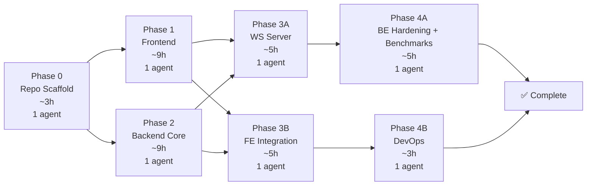

| Phase | Duration | Agents | Parallelism |
|---|---|---|---|
| 0 — Scaffold | ~3h | 1 | — |
| 1 — Frontend | ~9h | 1 | ‖ with Phase 2 |
| 2 — Backend Core | ~9h | 1 | ‖ with Phase 1 |
| 3A — WS Server | ~5h | 1 | ‖ with Phase 3B (HTTP part) |
| 3B — FE Integration | ~5h | 1 | ‖ with Phase 3A; WS swap + E2E after 3A |
| 4A — BE Hardening + benchmarks | ~5h | 1 | ‖ with Phase 4B |
| 4B — DevOps | ~3h | 1 | ‖ with Phase 4A |
| **Total (parallel)** | **~24h wall-clock** | **up to 2 agents** | |

---

## 19. Deployment & DevOps

### CI/CD Pipeline

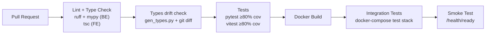

CD (deployment on merge) is documented only; v1 ships CI.

### Migration Strategy

Migrations run in a dedicated one-shot `migrate` container. With two or more backend replicas, running `alembic upgrade head` inside each app container would race; the backend services therefore wait for `migrate` to complete successfully.

```bash
# docker-compose: migrate service command
alembic upgrade head

# Create a new migration:
alembic revision --autogenerate -m "describe_change"
# Review the generated file: the partial GiST index (areas_geom_gist) is maintained by hand.
```

---

## 20. Known Limitations & Future Work

| Item | Status | Future Plan |
|---|---|---|
| govmap satellite tiles | ⚠️ Evaluated in Phase 1 (ADR-004); govmap XYZ endpoint provides street vector basemap rather than aerial imagery | Esri World Imagery is implemented as the primary satellite layer; GovMap/OSM available as fallback; documented in README and ADR-004 |
| Real-time OT/CRDT | OCC only; edits of one area are arbitrated per save | Yjs/Automerge for vertex-level merge |
| Edit-intent indicators | Not implemented (conflicts are detected at save or via `AREA_UPDATED`) | Advisory "user X is editing" markers to prevent conflicts earlier |
| Mobile touch drawing | Not optimized | Touch gestures for vertex placement |
| Polygon holes / MultiPolygon / merge-union | Not implemented | PostGIS `ST_Union` + UI tool; holes via `geometry(Polygon)` interior rings |
| Fan-out scope | Single global room; every client receives all previews | Viewport-scoped fan-out (per-tile channels), then Kafka/NATS at > ~10k concurrent users |
| Missed broadcast after commit | If publishing to Redis fails after a DB commit, the event is not delivered live | Transactional outbox; clients also re-sync on reconnect and via `RESYNC_REQUIRED` |
| Redis availability | Single node; degrades gracefully | Sentinel / Cluster |
| Read replica, PgBouncer, Loki | Documented only | Add with read-your-writes routing when read load requires it |
| CD pipeline | Not implemented | Deploy on merge to main |
| Offline support | Not implemented | Service Worker + IndexedDB drafts |
| Export (GeoJSON/KML) | Not implemented | Export API + download |
| Multi-project scoping | Single global room | `project_id` + room per project |
| Fine-grained conflict UI | Accept / Overwrite / Save as new | Visual diff overlay |
| Permissions | Any authenticated user can edit any area (collaborative model) | Role-based area permissions |
| Live vs. saved area | Browser shows a spherical estimate ("≈"); server value is authoritative | Use `geographiclib` in the browser to remove the difference |
